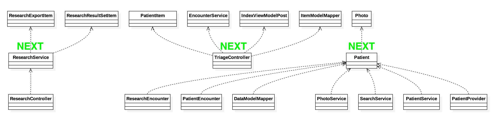

# Change Request Log

## Team: Group 1

txz150730 - Tianxiang Zhang  
zxq150130 - Zengtai Qi (Shane)

## Change Request: FEMR-137

Description:  

Researchers want fEMR to flag whether or not the patient's birthdate is real or if fEMR tried to guess what it was. So that data is accurately stored with integrity.

Notes:  
- Patients often do not know what day they were born and sometimes don't even know their age.
- fEMR allows you to identify how old a patient is in 3 different ways: enter the actual birthdate, enter an age integer, or select a category (child,adult,elder,etc).
- The database has 2 options of storing this data - a birthdate OR the category. If the user enters an age integer, the system will create a fake birthdate, but it won't flag the birthdate as fake for future reference.

## Concept Location

\# | Description | Rationale
---|---|---
1 | We understand the problem in the persistent storing layer, but not quite sure how and where exactly to reproduce the problem and test after changing. So we sent email to Kevin Zurek for some clarifications. According to Kevin's response, the problem is that when researchers export data to csv file, there is no flag to tell whether or not the patient's birthdate is real. | Clarify the problem.
2 | We think more than one location might be involved in this change. We list them as:  1. CSV exporting logic.   2. Database structure.   3. Models.   4. User Interface. | We were not sure if database supports this feature.
3 | We decided to do the concept location phase for the two locations separately. | The two locations seems far from each other.

### CSV Exporting
\# | Description | Rationale
---|---|---
1 | We ran the system. |
2 | We interacted with the system: after logging in we entered the 'research' view, and then we filled in the form and click `Export Data` button. We opened the CSV file we got from the website, there is only 'age' filed, no 'birthday' field nor flag of if birthday is fake.  | In order to locate the page of the problem and reproduce the problem.
3 | We navigated to the html template file of 'research' view (`./app/femr/ui/views/admin/research/index.scala.html`) via IDE project tree view window. | According to common sense of web framework, there should a template file of the edit page. And it turned out there does is a template html file.
4 | We searched keywords 'Export Data' in the template html file, and find the button dom. But no lucky, can't see what action the button triggers. |
5 | We made an assumption that the button fires an Javascript function. So we went to the browser, used the browser developing tool to find out the dom id of the 'Export Data' button, then search the id ('export-button') as keywords in all Javascript files of this webpage. We finally found out that the button does fire a Javascript function which just simply submits the form with id 'graph-options'. | Here we used some acknowledge of Javascript and jQuery which we didn't record much details.
6 | We went back to the html template file of 'research' view (`./app/femr/ui/views/admin/research/index.scala.html`) and searched the form with id 'graph-options', and we finally found out that CSV files comes from `ResearchController.exportPost()`. |
7 | In `ResearchController.exportPost()`, we found out that it only simply returns response along with the CSV file. CSV file actually comes from interface method: `IResearchService.retrieveCsvExportFile()`. We used IDE 'navigate to implementations' tool navigated to class `ResearchService` which implements method `retrieveCsvExportFile()`. |
8 | We looked into `ResearchService` a little bit, it has a private method `createResearchExportItem()` which is in charge of adding fields for every CSV row. We put class `ResearchService` into our initial impact set. | Successfully located CSV exporting concept location.

### Database Structure

\# | Description | Rationale
---|---|---
1 | We opened the database with MySQL command line tool and inspected all the tables (ordered by the possibility of containing age/birthday information). | In order to find out how the system stores age information.
2 | After inspection we found out table `patients` has a column `age` storing birthday date of patients, table `patient_age_classifications` stores all the categories of patients' age and table `patient_encounters` has a column `patient_age_classification_id` connect patient's encounters with age categories. |
3 | Since birthday date is absolute while patient_age_classifications is relative (relative to when the record was recorded into the system). We asserted that birthday date and patient_age_classifications should be two different concept. We decided to find a way giving the `age` column of table `patients` a flag. | Narrow down the concept location area.
4 | We inspected table `patients`, existed columns didn't support having a flag implicitly without altering data. We decided to add a new column storing the birthday\_is\_fake flag. |
5 | We searched keywords 'add column play framework' on Google, and learned that we should add `.sql` file in `./conf/evolutions.default/` directory. | Successfully located database structure changing concept location.

### Models

\# | Description | Rationale
---|---|---
1 | Since we add a column into patients table, we went the `./app/femr/data/models/` and found out the class `Patient`. We put it into initial impact set. | According to common sense of MCV pattern, models are possibly defined here. And in the `Patient` class we found, there are properties binded to column.

### User Interface

\# | Description | Rationale
---|---|---
1 | Since we added a flag for patients' birthday, user interface should also be change to support flagging birthday as fake or not fake. | Considering the consistent of the system.
2 | We figured the first file needs modify is html template file (`./app/femr/ui/views/admin/triage/index.scala.html`). But it's not a class. | We should stop until we reach the file class to change.
3 | We searched keywords 'Age' within the html template file and with IDE find tool. We found out that this form will be submitted into action `TriageController.indexPost()`, we put class `TriageController` into initial impact set. |

__Time Spent: 120 mins__  
__Recorder: Shane Qi__

## Impact Analysis

\# | Description | Rationale
---|---|---
1 | We have the initial impact set: (`ResearchService`, `Patient`, `TriageController`) |
2 | We searched usages of `ResearchService` and `IResearchService` in the project via IDE 'search usages tool', included `ResearchController` into impact set. | In order to find classes that depends on `ResearchService`.
3 | We did the dependencies analysis with IDE 'Analyze Dependencies' tool on class `ResearchService`, and put `ResearchExportItem` and `ResearchResultSetItem` into impact set | In order to find `ResearchService`'s dependencies.
3 | We searched usages of `Patient` and its interface `IPatient` put `ResearchEncounter`, `PatientEncounter`, `PatientProvider`, `PatientService`, `PhotoService`, `SearchService`, and `DataModelMapper` into impact set. |
4 | We did the dependencies analysis on `Patient`, and put `Photo` into impact set. |
5 | We searched class `TriageController`'s usages, but there is no solid class except `Routes.scala`. We didn't put any other class into impact set here. |
6 | We did dependencies analysis on `TriageController`, and put `PatientItem`, `ItemModelMapper`, `IndexViewModelPost` and `EncounterService` into impact set. |
7 | We finished estimated impact set as:   |
8 | We marked `ResearchService` as 'CHANGED' and marked `ResearchExportItem`, `ResearchResultSetItem` and `ResearchController` as 'NEXT'. | We already decided to make changes on `ResearchService` in the concept location phase.
9 | We inspected `ResearchExportItem`, this class is kind of a model of every CSV row, since we planed to add a column into CSV file, we marked this class as 'Changed'. |
10 | We inspected `ResearchResultSetItem`, this class doesn't hold information about CSV file, we marked it as 'Unchanged'. |
11 | We inspected `ResearchController`, this class only dispatch different requests to different delegate class and return the responses with content, doesn't hold logic about response content, we marked it as 'Unchanged'. |
12 | We marked `Patient` as 'Changed'. And marked `ResearchEncounter`, `PatientEncounter`, `PatientProvider`, `PatientService`, `PhotoService`, `SearchService`, `DataModelMapper` and `Photo` as 'NEXT'. | This is a member of initial impact set, should be marked 'Changed' and mark neighbors as 'NEXT'.
13 | We inspected `ResearchEncounter`, it doesn't hold patients' birthday information, we marked it as 'Unchanged'  |
14 | We inspected `PatientEncounter`, it doesn't hold patients' birthday information, we marked it as 'Unchanged'  |
15 | We inspected `PatientProvider`, it's an generics interface in defined in Play framework, can't be changed, we marked it as 'Unchanged'.  |
16 | We inspected `PatientService`, this is kind of an middleware between database and MVC framework, since model `Patient` is gonna be changed, we marked it as 'Changed'.  |
17 | We inspected `PhotoService`, it only deal with fetching and saving a patient's photo, since we won't make change on patient photo, we marked this class as 'Unchanged'.  |
18 | We inspected `SearchService`, it contains a method which fetch a patient's whole information by id, since we were gonna make changes on model `Patient`, we marked this class as 'Changed'. |
19 | We inspected `DataModelMapper`, it's the map between model's properties and database column, it definitely need changed, we marked it as 'Changed'. |
20 | We inspected `Photo`, this is a model class, a photo belongs to a patient, it won't be impacted by change on `Patient`, we marked it as 'Unchanged'.  |
21 | We marked `TriageController` as 'Changed'. And marked `PatientItem`, `ItemModelMapper`, `IndexViewModelPost` and `EncounterService` with 'NEXT'. | This is a member of initial impact set, should be marked 'Changed' and mark neighbors as 'NEXT'.
22 | We inspected `PatientItem`, this is kind of a wrapper class making model `Patient` adaptive to other classes like `IndexViewModelPost`. It has all properties corresponding to `Patient`. Since `Patient` is gonna be changed, we marked this class with 'Changed'. |
22 | We inspected `ItemModelMapper`, it's the mapper class which contains `PatientItem`'s map method, we had to marked it as 'Changed' since `PatientItem` was marked 'Changed'. |
23 | We inspected `IndexViewModelPost`, this class is a viewModel class. Front end (html) form information will be bind to this class's properties. Since the we were gonna do a little change from front end, we marked this class with 'Changed'. |
24 | We inspected `EncounterService`, this class fetches and stores patient's encounters, won't be impacted. We marked it with 'Unchanged'. |
25 | No more classes are marked 'NEXT', we finished impact analysis with:   |

__Time Spent: 120 mins__  
__Recorder: Shane Qi__
