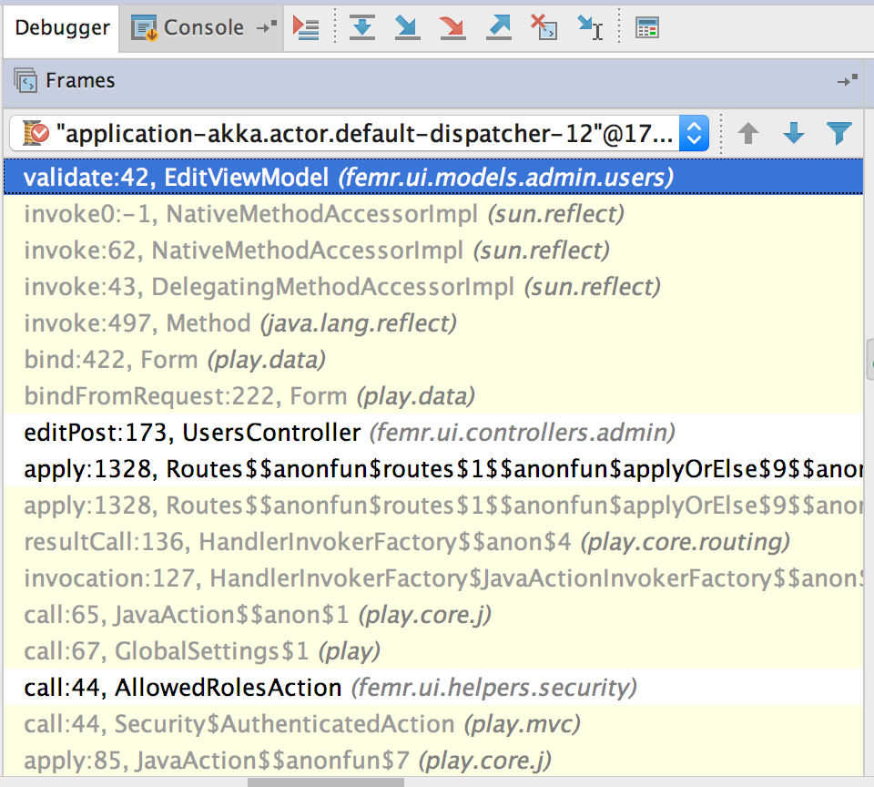

# Change Request Log

## Team: Group 1

txz150730 - Tianxiang Zhang  
zxq150130 - Zengtai Qi (Shane)

## Change Request: FEMR-158

Description:  
If an administrator tries to edit a user, the "Change User Password" input fields are required and a notification gets sent back that the "password field is empty".
Action should only be taken if these fields are filled out - they shouldn't be required to be filled out.

## Concept Location

\# | Description | Rationale
---|---|---
1 | We ran the system. |
2 | We interacted with the system: after logging in we entered the 'admin' view, and then 'users' tab. Then we entered 'edit' page of one of users. | In order to locate the page of the problem that the change request talks about.
3 | We edited the user’s first name and without enter any character in the two 'Change User Password' text fields. Then we click 'save' button. | In order to reproduce the problem.
4 | After we clicked 'save' button, the save didn’t success, and we got 'password field is empty' alert. | Successfully reproduced the problem.
5 | We switched to IDE then navigated to file: `./app/femr/ui/views/admin/users/edit.scala.html` with IDE project tree view window. | According to common sense of web framework, there should a template file of the edit page. And it turned out there does is a template html file.
6 | We searched keyword 'Change User Password' with IDE 'Find' tool. And located the form code. | If the project doesn’t have internationalization and localization, the form fields labels are possibly hard-coded. And it turned out that form fields labels are hard-coded.
7 | According to the form code we found in template file, we navigated to file `./app/femr/ui/controllers/admin/UsersController.java` method `editPost`.  | The template code indicated that the form submission would be routed to UsersController and editPost method
8 | We tried to find `if` statement on text fields’ text or keywords 'password field is empty' in `editPost` method. | There must be a `if` statement to return some error on the condition password fields are empty.
9 | We use 'Find' tool search keywords 'password field is empty' in the whole fEMR module, there was only one result which points to `validate()` method of class `EditViewModel`. We went to the file via double-clicking find result, and there are several `if` statements on form fields content which is what we had been finding. | Luckily, the ‘password field is empty’ string is also hard-coded.
10 | We made a breakpoint in the first line in `validate()` method of class `EditViewModel`. Then re-ran the project in debug mode. | In order to make sure the `validate()` method of class `EditViewModel` is invoked in edit form submission.
11 | Again we edited the user’s first name and without enter any character in the two 'Change User Password' text fields. Then we click 'save' button.|
12 | The project paused at the breakpoint. Which means `validate()` method of class `EditViewModel` is possibly where we should make modification. |
13 | Besides, in the debug view, we track the invoking stack, the invoking chain only contains three internal invocations: the first was Routes (we don’t care), the second was in UsersController (we’d been here), it was the invocation of method `bindFromRequest()` of class `Form<>`, the third was `validate()` method of class `EditViewModel`. |
14 |  |
15 | | |
14 | According to what we found out above, we marked these two classes: `UsersController` and `EditViewModel`. | Directly modify `validate()` method of class `EditViewModel` might not be a good decision, because of possible hierarchy and polymorphism. So we also include class `UsersController` into init impact set.

__Time Spent: 120 mins__  
__Recorder: Shane Qi__

## Impact Analysis

\# | Description | Rationale
---|---|---
1 | We have the initial impact set: (`EditViewModel`, `UsersController`). And marked `EditViewModel` as 'CHANGED'. |
3 | We looked into class `UsersController`, actually it doesn't directly have an property of type `EditViewModel`. It has an property of  type `From<EditViewModel>`. |
6 | We found out definition of `From<T>` with shortcut COMMAND + CLICK. It turns out a play framework class. We put this class into impact set but marked as 'UNCHANGED' and marked `UsersController` as 'NEXT'. | We can't change framework classes.
4 | We search the usage of class `EditViewModel`) with shortcut OPTION + F7 (Find usage tool). There is only one instance creation in `UsersController`. And there is no subclassed inherited from `EditViewModel`. `EditViewModel` is not any class's subclass, either. | Analysis dependencies and try to add more class into estimated impact set.
5 | We search the usage of class `UsersController`) with shortcut OPTION + F7 (Find usage tool). Except usages in routers and templates. There is reference to any instance of `UserController`.  There is no subclassed inherited from `UserController`, either. (not unexpected for an controller class.) | Analysis dependencies and try to add more class into estimated impact set.
6 | We had an estimated impact set: (`EditViewModel`(CHANGED), `UsersController`(NEXT), `Form<T>`(UNCHANGED)). | Finished impact set analysis.
7 | We started inspecting `UsersController`, and no other classes have to be marked as 'NEXT'. | `UsersController` is a class marked 'NEXT'.
8 | The invocation chain from `UsersController` to `EditViewModel` is: `UsersController.editPost()` -> `Form<EditViewModel>.bindFromRequest()`(framework) -> `Form<EditViewModel>.bind()`(framework) -> `EditViewModel.validate()`. | In order to inspect deeply into `UsersController`.
9 | We found out that no matter what errors returned from `Form<EditViewModel>.bindFromRequest()`, `UsersController` just naively forward errors to the front end (render bad request view).  |
10 | And even if in the case that `userPassword` and `userPasswordVerify` being both empty is not treated as an error (how we planed to fix the bug), there is a `if` statement to check if two fields are both filled before perform the next action (perform password changing). |
10 | According to the above two points, if we change the logic of `EditViewModel.validate()`, `UsersController` is not gonna be impacted. So we marked `UsersController` as 'UNCHANGED'. | `UsersController` is not gonna be impacted.
11 | No class is marked 'NEXT', we finished impact analysis with a result set: (`EditViewModel`(CHANGED), `UsersController`(UNCHANGED), `Form<T>`(UNCHANGED)). |
12 |  |

__Time Spent: 120 mins__  
__Recorder: Shane Qi__

## Prefactoring

\# | Description | Rationale
---|---|---
1 | We inspected the method `EditViewModel.validate()`, we only need to add a handle for the case that both `userPassword` and `userPasswordVerify` are empty, no need for making big changes. |
2 | We decided to skip refactoring. |

__Time Spent: 10 mins__  
__Recorder: Shane Qi__

## Actualization

\# | Description | Rationale
---|---|---
1 | We looked into `EditViewModel.validate()`, found out that there are three `if` statement to validate password fields: `(newPassword.isEmpty() or newPasswordVerify.isEmpty()`, `!newPassword.equals(newPasswordVerify)` and whether `newPassword` conforms to constraints. |
2 | When neither `userPassword` nor `userPasswordVerify` is filled, the control flow goes into the condition `(newPassword.isEmpty() or newPasswordVerify.isEmpty()`. | Inspect how the control flow is under the problem case.
3 | We think those three `if` statements are only applicable under the case that neither `userPassword` nor `userPasswordVerify` is empty. | Find out what's wrong with the code.
4 | We decided to embed all these three into another `if` statement: `if(!(newPassword.isEmpty() && newPasswordVerify.isEmpty()))`. | This change makes sure that only under the condition that neither `userPassword` nor `userPasswordVerify` is empty, the code perform the password fields validation. Otherwise, the code will just ignore the password fields (not returning any error).
5 | We wrote the new `if` condition then moved those three condition into the new condition block. |
6 | We committed and pushed our changes with git. | Just in case we need to revert our changes.

__Time Spent: 30 mins__  
__Recorder: Shane Qi__

## Postfactoring

\# | Description | Rationale
---|---|---
1 | We reviewed the change we made, not any anti-patterns were introduced. | The change we made is not a big one.
2 | We decided to skip postfactoring.  |

__Time Spent: 10 mins__  
__Recorder: Shane Qi__

## Validation

\# | Description | Rationale
---|---|---
1 | Since we found out that most code under `test` directory was commented out, we asked the team via Slack for some clarification of unit tests. It turned out they had a long story of unit tests and they don't have a unit test environment for now. We decided to have more comprehensive tests from front end.  |
1 | We re-ran the system. | Making sure change was applied to the system.
2 | We went to the users page and began edit the information of the user we used to login. | Edit the user we used to login makes it easy for us to verify if we successfully changed the password in the next step.
3 | __First case__: only change the 'About' information of the user and submit the form. Then logout and login with original password.  __Expected result__: no error, 'About' information should be updated and re-login should succeed.  __Result__: no error, 'About' information was updated and re-login succeeded. | This is an exceptional behavior, if the two passwords fields are empty, just don't perform password changing and not throwing errors, either.
4 | __Second case__: fill the two new password fields with a valid password, then re-loin with the new password.  __Expected result__: no error, re-login with new password should succeed.  __Result__: no error, re-login with new password succeed. | This is an exceptional behavior, we kept what worked right working right.
5 | __Third case__: only fill the new password field (without filling new password verify field) with a valid password, then submit the form.  __Expected result__: should receive error.  __Result__: receive error. | This is an exceptional behavior, we kept validation working right.
6 | __Third case__: only fill the verify new password field (without filling new password field) with a valid password, then submit the form.  __Expected result__: should receive error.  __Result__: receive error. | This is an exceptional behavior, we kept validation working right.
7 | __Third case__: fill the new password field with a valid password while fill the new password verify field a different valid password, then submit the form.  __Expected result__: should receive error.  __Result__: receive error. | This is an exceptional behavior, we kept validation working right.
8 | __Third case__: fill the two new password fields with an invalid password ("111" too short), then submit the form.  __Expected result__: should receive error.  __Result__: receive error. | This is an exceptional behavior, we kept validation working right.

__Time Spent: 20 mins__  
__Recorder: Shane Qi__

## Timing

Phase Name | Time (minutes)
---|---
Concept Location | 120
Impact Analysis | 120
Prefactoring | 10
Actualization | 30
Postfactoring | 10
Validation | 20
Total | 310

__Recording Time Included__

## Conclusions

For this change, concept location took us a lot time. I think it's not bad spending more time in any phase, but I think we should delay doing some stuff to the second phase. For example, we don't have to dig very deep in the concept location phase, since we will do such thing more comprehensive in the impact analysis phase (estimate impact set).  
Concept location and impact analysis was completed mainly with find tool within the IDE such as search keywords and search class usage in the whole project.  
As we recored in the first step of Validation phase, there isn't a configured unit test environment for this project, so we just manually tested bug fixing from front end. In order to make is more reliable, we did a lot comprehensive tests. Since the change is a minor one, we think those tests are sufficient.

Classes and methods changed:
- `./app/femr/ui/models/admin/users/EditViewModel/EditViewModel.validate()`
