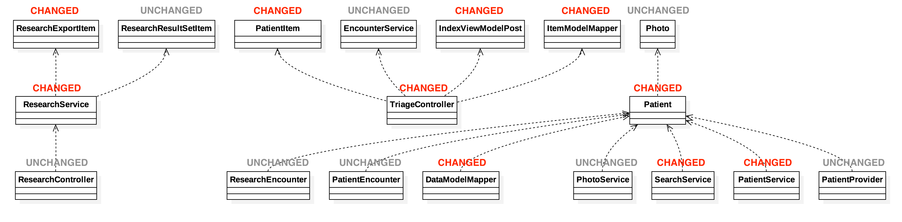
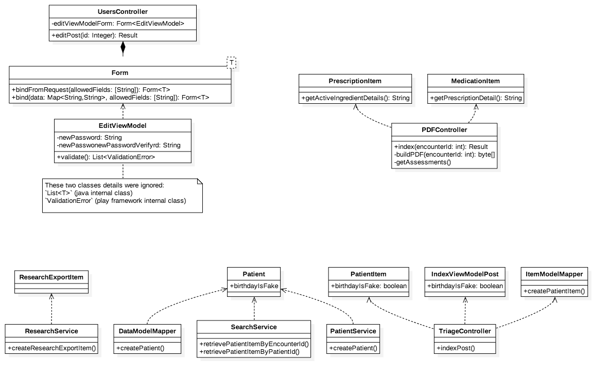
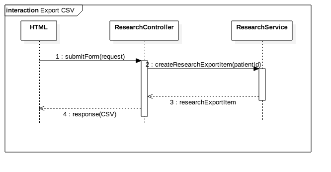

# Change Request Log

## Team: Group 1

txz150730 - Tianxiang Zhang  
zxq150130 - Zengtai Qi (Shane)

## Change Request: FEMR-137

Description:  

Researchers want fEMR to flag whether or not the patient's birthdate is real or if fEMR tried to guess what it was. So that data is accurately stored with integrity.

Notes:  
- Patients often do not know what day they were born and sometimes don't even know their age.
- fEMR allows you to identify how old a patient is in 3 different ways: enter the actual birthdate, enter an age integer, or select a category (child,adult,elder,etc).
- The database has 2 options of storing this data - a birthdate OR the category. If the user enters an age integer, the system will create a fake birthdate, but it won't flag the birthdate as fake for future reference.

## Concept Location

\# | Description | Rationale
---|---|---
1 | We understand the problem in the persistent storing layer, but not quite sure how and where exactly to reproduce the problem and test after changing. So we sent email to Kevin Zurek for some clarifications. According to Kevin's response, the problem is that when researchers export data to csv file, there is no flag to tell whether or not the patient's birthdate is real. | Clarify the problem.
2 | We think more than one location might be involved in this change. We list them as:  1. CSV exporting logic.   2. Database structure.   3. Models.   4. User Interface. | We were not sure if database supports this feature.
3 | We decided to do the concept location phase for the two locations separately. | The two locations seems far from each other.

### CSV Exporting
\# | Description | Rationale
---|---|---
1 | We ran the system. |
2 | We interacted with the system: after logging in we entered the 'research' view, and then we filled in the form and click `Export Data` button. We opened the CSV file we got from the website, there is only 'age' filed, no 'birthday' field nor flag of if birthday is fake.  | In order to locate the page of the problem and reproduce the problem.
3 | We navigated to the html template file of 'research' view (`./app/femr/ui/views/admin/research/index.scala.html`) via IDE project tree view window. | According to common sense of web framework, there should a template file of the edit page. And it turned out there does is a template html file.
4 | We searched keywords 'Export Data' in the template html file, and find the button dom. But no lucky, can't see what action the button triggers. |
5 | We made an assumption that the button fires an Javascript function. So we went to the browser, used the browser developing tool to find out the dom id of the 'Export Data' button, then search the id ('export-button') as keywords in all Javascript files of this webpage. We finally found out that the button does fire a Javascript function which just simply submits the form with id 'graph-options'. | Here we used some acknowledge of Javascript and jQuery which we didn't record much details.
6 | We went back to the html template file of 'research' view (`./app/femr/ui/views/admin/research/index.scala.html`) and searched the form with id 'graph-options', and we finally found out that CSV files comes from `ResearchController.exportPost`. We put class `ResearchController` into the initial impact set. | Successfully located CSV exporting concept location.

### Database Structure

\# | Description | Rationale
---|---|---
1 | We opened the database with MySQL command line tool and inspected all the tables (ordered by the possibility of containing age/birthday information). | In order to find out how the system stores age information.
2 | After inspection we found out table `patients` has a column `age` storing birthday date of patients, table `patient_age_classifications` stores all the categories of patients' age and table `patient_encounters` has a column `patient_age_classification_id` connect patient's encounters with age categories. |
3 | Since birthday date is absolute while patient_age_classifications is relative (relative to when the record was recorded into the system). We asserted that birthday date and patient_age_classifications should be two different concept. We decided to find a way giving the `age` column of table `patients` a flag. | Narrow down the concept location area.
4 | We inspected table `patients`, existed columns didn't support having a flag implicitly without altering data. We decided to add a new column storing the birthday\_is\_fake flag. |
5 | We searched keywords 'add column play framework' on Google, and learned that we should add `.sql` file in `./conf/evolutions.default/` directory. | Successfully located database structure changing concept location.

### Models

\# | Description | Rationale
---|---|---
1 | We went the `./app/femr/data/models/` and found out the class `Patient`. We put class `Patient` into initial impact set. | According to common sense of MCV pattern, models are possibly defined here. And in the `Patient` class we found, there are properties binded to column.

### User Interface

\# | Description | Rationale
---|---|---
1 | Since we added a flag for patients' birthday, user interface should also be change to support flagging birthday as fake or not fake. | Considering the consistent of the system.
2 | We figured the first file needs modify is html template file (`./app/femr/ui/views/admin/triage/index.scala.html`). But it's not a class. | We should stop until we reach the file class to change.
3 | We searched keywords 'Age' within the html template file and with IDE find tool. We found out that this form will be submitted into action `TriageController.indexPost()`, we put class `TriageController` into initial impact set. |

__Time Spent: 120 mins__  
__Recorder: Shane Qi__

## Impact Analysis

\# | Description | Rationale
---|---|---
1 | We have the initial impact set: () `ResearchController`(CHANGED),  `Patient`(CHANGED),  `TriageController`(CHANGED)) |
2 |

1 | We have the initial impact set: (`EditViewModel`, `UsersController`). And marked `EditViewModel` as 'CHANGED'. |
3 | We looked into class `UsersController`, actually it doesn't directly have an property of type `EditViewModel`. It has an property of  type `From<EditViewModel>`. |
6 | We found out definition of `From<T>` with shortcut COMMAND + CLICK. It turns out a play framework class. We put this class into impact set but marked as 'UNCHANGED' and marked `UsersController` as 'NEXT'. | We can't change framework classes.
4 | We search the usage of class `EditViewModel`) with shortcut OPTION + F7 (Find usage tool). There is only one instance creation in `UsersController`. And there is no subclassed inherited from `EditViewModel`. `EditViewModel` is not any class's subclass, either. | Analysis dependencies and try to add more class into estimated impact set.
5 | We search the usage of class `UsersController`) with shortcut OPTION + F7 (Find usage tool). Except usages in routers and templates. There is reference to any instance of `UserController`.  There is no subclassed inherited from `UserController`, either. (not unexpected for an controller class.) | Analysis dependencies and try to add more class into estimated impact set.
6 | We had an estimated impact set: (`EditViewModel`(CHANGED), `UsersController`(NEXT), `Form<T>`(UNCHANGED)). | Finished impact set analysis.
7 | We started inspecting `UsersController`, and no other classes have to be marked as 'NEXT'. | `UsersController` is a class marked 'NEXT'.
8 | The invocation chain from `UsersController` to `EditViewModel` is: `UsersController.editPost()` -> `Form<EditViewModel>.bindFromRequest()`(framework) -> `Form<EditViewModel>.bind()`(framework) -> `EditViewModel.validate()`. | In order to inspect deeply into `UsersController`.
9 | We found out that no matter what errors returned from `Form<EditViewModel>.bindFromRequest()`, `UsersController` just naively forward errors to the front end (render bad request view).  |
10 | And even if in the case that `userPassword` and `userPasswordVerify` being both empty is not treated as an error (how we planed to fix the bug), there is a `if` statement to check if two fields are both filled before perform the next action (perform password changing). |
10 | According to the above two points, if we change the logic of `EditViewModel.validate()`, `UsersController` is not gonna be impacted. So we marked `UsersController` as 'UNCHANGED'. | `UsersController` is not gonna be impacted.
11 | No class is marked 'NEXT', we finished impact analysis with a result set: (`EditViewModel`(CHANGED), `UsersController`(UNCHANGED), `Form<T>`(UNCHANGED)). |
12 |  |

__Time Spent: 120 mins__  
__Recorder: Shane Qi__

## Prefactoring

\# | Description | Rationale
---|---|---
1 | We inspected the method `EditViewModel.validate()`, we only need to add a handle for the case that both `userPassword` and `userPasswordVerify` are empty, no need for making big changes. |
2 | We decided to skip refactoring. |

__Time Spent: 10 mins__  
__Recorder: Shane Qi__

## Actualization

\# | Description | Rationale
---|---|---
1 | We looked into `EditViewModel.validate()`, found out that there are three `if` statement to validate password fields: `(newPassword.isEmpty() or newPasswordVerify.isEmpty()`, `!newPassword.equals(newPasswordVerify)` and whether `newPassword` conforms to constraints. |
2 | When neither `userPassword` nor `userPasswordVerify` is filled, the control flow goes into the condition `(newPassword.isEmpty() or newPasswordVerify.isEmpty()`. | Inspect how the control flow is under the problem case.
3 | We think those three `if` statements are only applicable under the case that neither `userPassword` nor `userPasswordVerify` is empty. | Find out what's wrong with the code.
4 | We decided to embed all these three into another `if` statement: `if(!(newPassword.isEmpty() && newPasswordVerify.isEmpty()))`. | This change makes sure that only under the condition that neither `userPassword` nor `userPasswordVerify` is empty, the code perform the password fields validation. Otherwise, the code will just ignore the password fields (not returning any error).
5 | We wrote the new `if` condition then moved those three condition into the new condition block. |
6 | We committed and pushed our changes with git. | Just in case we need to revert our changes.

__Time Spent: 30 mins__  
__Recorder: Shane Qi__

## Postfactoring

\# | Description | Rationale
---|---|---
1 | We reviewed the change we made, not any anti-patterns were introduced. | The change we made is not a big one.
2 | We decided to skip postfactoring.  |

__Time Spent: 10 mins__  
__Recorder: Shane Qi__

## Validation

\# | Description | Rationale
---|---|---
1 | Since we found out that most code under `test` directory was commented out, we asked the team via Slack for some clarification of unit tests. It turned out they had a long story of unit tests and they don't have a unit test environment for now. We decided to have more comprehensive tests from front end.  |
1 | We re-ran the system. | Making sure change was applied to the system.
2 | We went to the users page and began edit the information of the user we used to login. | Edit the user we used to login makes it easy for us to verify if we successfully changed the password in the next step.
3 | __First case__: only change the 'About' information of the user and submit the form. Then logout and login with original password.  __Expected result__: no error, 'About' information should be updated and re-login should succeed.  __Result__: no error, 'About' information was updated and re-login succeeded. | This is an exceptional behavior, if the two passwords fields are empty, just don't perform password changing and not throwing errors, either.
4 | __Second case__: fill the two new password fields with a valid password, then re-loin with the new password.  __Expected result__: no error, re-login with new password should succeed.  __Result__: no error, re-login with new password succeed. | This is an exceptional behavior, we kept what worked right working right.
5 | __Third case__: only fill the new password field (without filling new password verify field) with a valid password, then submit the form.  __Expected result__: should receive error.  __Result__: receive error. | This is an exceptional behavior, we kept validation working right.
6 | __Third case__: only fill the verify new password field (without filling new password field) with a valid password, then submit the form.  __Expected result__: should receive error.  __Result__: receive error. | This is an exceptional behavior, we kept validation working right.
7 | __Third case__: fill the new password field with a valid password while fill the new password verify field a different valid password, then submit the form.  __Expected result__: should receive error.  __Result__: receive error. | This is an exceptional behavior, we kept validation working right.
8 | __Third case__: fill the two new password fields with an invalid password ("111" too short), then submit the form.  __Expected result__: should receive error.  __Result__: receive error. | This is an exceptional behavior, we kept validation working right.

__Time Spent: 20 mins__  
__Recorder: Shane Qi__

## Timing

Phase Name | Time (minutes)
---|---
Concept Location | 120
Impact Analysis | 120
Prefactoring | 10
Actualization | 30
Postfactoring | 10
Validation | 20
Total | 310

__Recording Time Included__

## Reverse engineering

### Class Diagram

### Sequence Diagram

## Conclusions

For this change, concept location took us a lot time. I think it's not bad spending more time in any phase, but I think we should delay doing some stuff to the second phase. For example, we don't have to dig very deep in the concept location phase, since we will do such thing more comprehensive in the impact analysis phase (estimate impact set).  
Concept location and impact analysis was completed mainly with find tool within the IDE such as search keywords and search class usage in the whole project.  
As we recored in the first step of Validation phase, there isn't a configured unit test environment for this project, so we just manually tested bug fixing from front end. In order to make is more reliable, we did a lot comprehensive tests. Since the change is a minor one, we think those tests are sufficient.

Classes and methods changed:
- `./app/femr/ui/models/admin/users/EditViewModel/EditViewModel.validate()`
