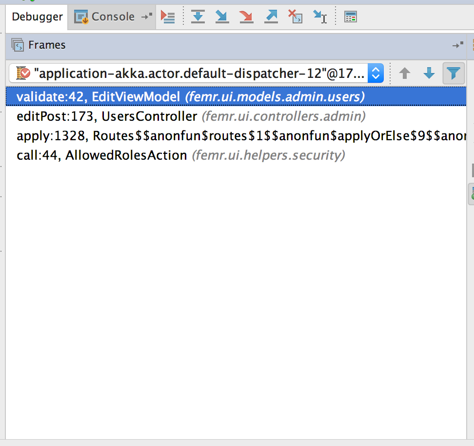

# Change Request Log

## Team: Group 1

txz150730 - Tianxiang Zhang  
zxq150130 - Zengtai Qi (Shane)

## Change Request: FEMR-158

Description:  
If an administrator tries to edit a user, the "Change User Password" input fields are required and a notification gets sent back that the "password field is empty".
Action should only be taken if these fields are filled out - they shouldn't be required to be filled out.

## Concept Location

\# | Description | Rationale
---|---|---
1 | We ran the system. |
2 | We interacted with the system: after logging in we entered the 'admin' view, and then 'users' tab. Then we entered 'edit' page of one of users. | In order to locate the page of the problem that the change request talks about.
3 | We edited the user’s first name and without enter any character in the two 'Change User Password' text fields. Then we click 'save' button. | In order to reproduce the problem.
4 | After we clicked 'save' button, the save didn’t success, and we got 'password field is empty' alert. | Successfully reproduced the problem.
5 | We switched to IDE then navigated to file: `./app/femr/ui/views/admin/users/edit.scala.html` with IDE project tree view window. | According to common sense of web framework, there should a template file of the edit page. And it turned out there does is a template html file.
6 | We searched keyword 'Change User Password' with IDE 'Find' tool. And located the form code. | If the project doesn’t have internationalization and localization, the form fields labels are possibly hard-coded. And it turned out that form fields labels are hard-coded.
7 | According to the form code we found in template file, we navigated to file `./app/femr/ui/controllers/admin/UsersController.java` method `editPost`.  | The template code indicated that the form submission would be routed to UsersController and editPost method
8 | We tried to find `if` statement on text fields’ text or keywords 'password field is empty' in `editPost` method. | There must be a `if` statement to return some error on the condition password fields are empty.
9 | We use 'Find' tool search keywords 'password field is empty' in the whole fEMR module, there was only one result which points to `validate()` method of class `EditViewModel`. We went to the file via double-clicking find result, and there are several `if` statements on form fields content which is what we had been finding. | Luckily, the ‘password field is empty’ string is also hard-coded.
10 | We made a breakpoint in the first line in `validate()` method of class `EditViewModel`. Then re-ran the project in debug mode. | In order to make sure the `validate()` method of class `EditViewModel` is invoked in edit form submission.
11 | Again we edited the user’s first name and without enter any character in the two 'Change User Password' text fields. Then we click 'save' button.|
12 | The project paused at the breakpoint. Which means `validate()` method of class `EditViewModel` is possibly where we should make modification. |
13 | Besides, in the debug view, we track the invoking stack, the invoking chain only contains three internal invocations: the first was Routes (we don’t care), the second was in UsersController (we’d been here), it was the invocation of method `bindFromRequest()` of class `Form<>`, the third was `validate()` method of class `EditViewModel`. |
14 |  |
15 | | |
14 | According to what we found out above, we marked these two classes: `UsersController` and `EditViewModel`. | Directly modify `validate()` method of class `EditViewModel` might not be a good decision, because of possible hierarchy and polymorphism. So we also include class `UsersController` into init impact set.

__Time Spent: 120 mins__  
__Recorder: Shane Qi__

## Impact Analysis

\# | Description | Rationale
---|---|---
1 | We have the initial impact set: (`EditViewModel`, `UsersController`). And marked `EditViewModel` as 'CHANGED'. |
3 | We looked into class `UsersController`, actually it doesn't directly have an property of type `EditViewModel`. It has an property of  type `From<EditViewModel>`. |
6 | We found out definition of `From<T>` with shortcut COMMAND + CLICK. It turns out a play framework class. We put this class into impact set but marked as 'UNCHANGED' and marked `UsersController` as 'NEXT'. | We can't change framework classes.
4 | We search the usage of class `EditViewModel`) with shortcut OPTION + F7 (Find usage tool). There is only one instance creation in `UsersController`. And there is no subclassed inherited from `EditViewModel`. `EditViewModel` is not any class's subclass, either. | Analysis dependencies and try to add more class into estimated impact set.
5 | We search the usage of class `UsersController`) with shortcut OPTION + F7 (Find usage tool). Except usages in routers and templates. There is reference to any instance of `UserController`.  There is no subclassed inherited from `UserController`, either. (not unexpected for an controller class.) | Analysis dependencies and try to add more class into estimated impact set.
6 | We had an estimated impact set: (`EditViewModel`(CHANGED), `UsersController`(NEXT), `Form<T>`(UNCHANGED)). | Finished impact set analysis.
7 | We started inspecting `UsersController`, and no other classes have to be marked as 'NEXT'. | `UsersController` is a class marked 'NEXT'.
8 | The invocation chain from `UsersController` to `EditViewModel` is: `UsersController.editPost()` -> `Form<EditViewModel>.bindFromRequest()`(framework) -> `Form<EditViewModel>.bind()`(framework) -> `EditViewModel.validate()`. | Analysis what should `UsersController` be marked.
9 | We found out that UsersController doesn't handle errors from `Form<EditViewModel>.bindFromRequest()`, so that errors would be presented to view without coming back to controller. Which means if we change the logic of `EditViewModel.validate()`, `UsersController` is not gonna be impacted. |
10 | We marked `UsersController` as 'UNCHANGED'. | Play framework handles errors, `UsersController` is not gonna be impacted.
11 | No class is marked 'NEXT', we finished impact analysis with a result set: (`EditViewModel`(CHANGED), `UsersController`(UNCHANGED), `Form<T>`(UNCHANGED)). |
12 |  |
