# Group 1 Final Project Report

`zxq150130` Shane Qi   
`txz150730` Tianxiang Zhang

## Part 1

### CC1

#### Step
1.	We run the terminal on Mac.
2.	We use the `diff –rp` to compare `0_before` and `1_after` folder. Following is what we’ve got.

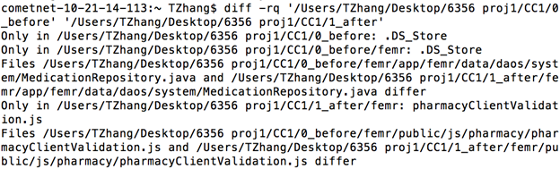

3.	We figured out that there are two `.DS_Store` files existing only in 0_before, but they seem like some system files so we are about to skip analyzing them. 
4.	`pharmacyClientValidation.js` appears only in 1_after\...\femr, i.e. it’s added during the change
5.	`MedicationRepository.java` and `pharmacyClientValidation.js` (under pharmacy folder) are two files that changed.

#### Analysis and Inference
1.	`MedicationRepository.java` -- line 149 - 151:
 We used notepad++ on Windows to check the difference between those two files and realize there is only one section changed as a new if statement is added.
 
 After reading the code, we believe that the change is to fix an existed bug that may return `null` only when name is missing but not when medication strength or medication form is missing, which is considered as a possible case (or less restriction on medication data entry). 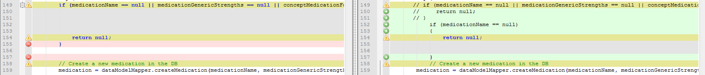

2.	`pharmacyClientValidation.js` under pharmacy folder -- line 6 - 11:
 We looked at both `pharmacyClientValidation.js` under pharmacy folders of before and after. And we notice that the only changed section is a condition statement about if a check box is checked or not. The contained string is about if the disclaimer has been read or not. 

 So we infer that the change is to ask patient or the guardian to check that they have read the disclaimer.
 
3.	`pharmacyClientValidation.js` under femr folder:
 We check the code with the `pharmacyClientValidation.js` under `pharmacy` folder, and realize that they're identical. An approach to figure out why this file is standing there is to find the connection of the other change to this file. But from the code of previous changed files, we get no clue about what this file is used for under the femr folder, so we believe that it is because the developer who conducted this change forgot to remove it after he/she pasted it there for some reason (easier to edit, etc.).

#### Justification
To justify our inference for the change of `MedicationRepository.java`, we run the 0_before and 1_after separately with Intelli J IDE. It shows that, under the Medical module, the after version supports to assign a new medication which has name only while the before version would prompt us that there is a run-time exception raised. Then on teamfemr at Atlassian we find that this issue seems like `FEMR-252 Submitting medications causes exception`.

To justify the change of `pharmacyClientValidaition.js`, we run the before and after versions, and it proves our inference since the check box does appear in the after version under the Pharmacy module. Then on teamfemr at Atlassian we know that this issue seems like`FEMR-138 Don't let a user submit on Pharmacy unless they check the disclaimer`.
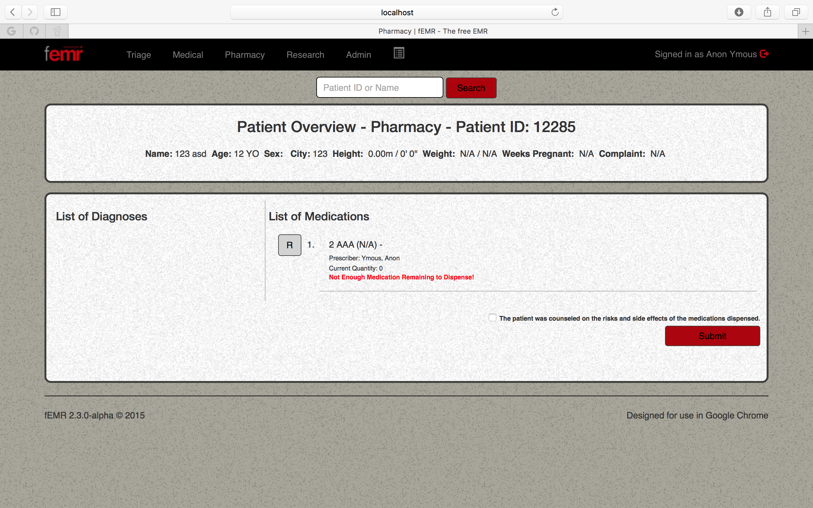

### CC2

#### Step
1.	We run the terminal on Mac.
2.	We use the `diff` command with `–rp` as the parameter to compare 0_before and 1_after folder. Following is what we’ve got.

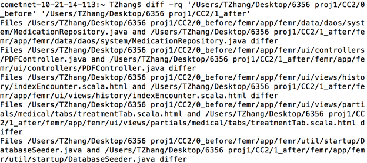


3.	We figured out that there are 5 files changed after the change request. 
4.	The name of changed files are: `MedicationRepository.java`, `PDFController.java`, `indexEncounter.scala.html`, `treatmentTab.scala.html` and `DatabaseSeeder.java`.

#### Analysis and Inference
1.	`MedicationRepository.java` -- line 149 - 151:
 Same like CC1, the change is to make it able to create new medication that has name but strength or form missing. And the solution here is exactly the same like the one in CC1. For inference, justification and more details, please go back to CC1.

2.	`treatmentTab.scala.html` -- line 68 - 70:
 In order to accurately reflect the data being stored in the object, the developer modified the element_id of the label to "procedure" as well as the text content of the label to "Procedure/Counselling" from "Treatment given". We believe that the goal of this change is to replace the previous term with professional terminology. The rest three changes are all respondences to this change. Basically, what they do is to replace all the "Treatment" element_id with "Procedure". 

3.	`indexEncounter.scala.html` – line 183:
 This line is a corresponding change to the change under `treatmentTab.scala.html`. After the change, the `get` method is catching the object with element_id = "Procedure" instead of "Treatment"

4.	`PDFController.java` -- line 401:
 This line is also a corresponding change to the change under `treatmentTab.scala.html`. After the change, the `get` method is catching the object with element_id = "Procedure" instead of "Treatment"

5.	`DatabaseSeeder.java` -- line 737 - 740:
 This change is also the respondence to the change of `tretmentTab.scala.html`, it replaces "Treatment" with "Procedure".

#### Justification
To justify the change of `MedicationRepository.java`, we run the project again with before and after versions. And then we figure out that under the `Medical` module, we can assign medication that has strength missing to patients while there raises an exception in the before version. Then on teamfemr at Atlassian we find that this issue seems like `FEMR-252 Submitting medications causes exception`.

To justify change of the rest four, we rerun the project with the before and after versions. And we find that the filed name of "Treatment given" has been changed to "Procedure" and both of them work properly. Then on teamfemr at Atlassian we know that this issue seems like `FEMR-185 Improve the "Treatment Given" field`.


## Part 2

### FEMR-208: encounter PDF not displaying amount of prescription dispensed

#### change1

```diff
diff -r -u 0_before/femr/app/femr/ui/controllers/PDFController.java 1_after/femr/app/femr/ui/controllers/PDFController.java
--- 0_before/femr/app/femr/ui/controllers/PDFController.java	2016-11-07 16:00:59.000000000 -0600
+++ 1_after/femr/app/femr/ui/controllers/PDFController.java	2016-11-05 12:18:49.000000000 -0500
@@ -439,6 +439,7 @@
 
             for (PrescriptionItem prescription : prescriptionItems) {
 
+                String medicationName =  prescription.getAmount() + " " + prescription.getName();
                 if (prescription.getOriginalMedicationName() != null) {
 
                     //jank way to strikethrough
@@ -449,11 +450,11 @@
 
                     table.addCell(cell);
 
-                    Paragraph replacedMedName = new Paragraph(prescription.getName(), getValueFont());
+                    Paragraph replacedMedName = new Paragraph(medicationName, getValueFont());
                     cell = new PdfPCell(replacedMedName);
                     table.addCell(cell);
                 } else {
-                    Paragraph medName = new Paragraph(prescription.getName(), getValueFont());
+                    Paragraph medName = new Paragraph(medicationName, getValueFont());
                     cell = new PdfPCell(medName);
                     table.addCell(cell);

```

#### change2

```diff
diff -r -u 0_before/femr/app/femr/ui/controllers/PDFController.java 1_after/femr/app/femr/ui/controllers/PDFController.java
--- 0_before/femr/app/femr/ui/controllers/PDFController.java	2016-11-07 18:25:34.000000000 -0600
+++ 1_after/femr/app/femr/ui/controllers/PDFController.java	2016-11-05 11:47:40.000000000 -0500
@@ -438,9 +438,7 @@
             table.completeRow();
 
             for (PrescriptionItem prescription : prescriptionItems) {
-
-                if (prescription.getOriginalMedicationName() != null) {
-
+                    if (prescription.getOriginalMedicationName() != null) {
                     //jank way to strikethrough
                     Chunk strikeThrough = new Chunk(prescription.getOriginalMedicationName(), getValueFont());
                     strikeThrough.setUnderline(0.1f, 3f);   // Thickness, the y axis location of
@@ -448,12 +446,13 @@
                     cell = new PdfPCell(originalMedName);
 
                     table.addCell(cell);
-
-                    Paragraph replacedMedName = new Paragraph(prescription.getName(), getValueFont());
+                    String pdfRMedName =     prescription.getAmount().toString() +"  "+prescription.getName();
+                    Paragraph replacedMedName = new Paragraph(pdfRMedName, getValueFont());
                     cell = new PdfPCell(replacedMedName);
                     table.addCell(cell);
                 } else {
-                    Paragraph medName = new Paragraph(prescription.getName(), getValueFont());
+                    String pdfNmedName =     prescription.getAmount().toString() +"  "+prescription.getName();
+                    Paragraph medName = new Paragraph(pdfNmedName, getValueFont());
                     cell = new PdfPCell(medName);
                     table.addCell(cell);
```

```diff
diff -r -u 0_before/femr/app/femr/ui/models/admin/users/EditViewModel.java 1_after/femr/app/femr/ui/models/admin/users/EditViewModel.java
--- 0_before/femr/app/femr/ui/models/admin/users/EditViewModel.java	2016-11-07 18:25:34.000000000 -0600
+++ 1_after/femr/app/femr/ui/models/admin/users/EditViewModel.java	2016-11-07 18:26:14.000000000 -0600
@@ -48,17 +48,13 @@
             errors.add(new ValidationError("email", "email is a required field"));
         if (!newPassword.equals(newPasswordVerify))
             errors.add(new ValidationError("newPassword", "passwords do not match"));
-        else if(newPassword.isEmpty() || newPasswordVerify.isEmpty())
-            errors.add(new ValidationError("newPassword", "password field is empty"));
-        else {
-            if(newPassword.length() < 6 || !hasUppercase.matcher(newPassword).find()
-                    || !hasNumber.matcher(newPassword).find())      //AJ Saclayan Password Constraints
+        else { if( !newPassword.isEmpty() && (newPassword.length() < 6 || !hasUppercase.matcher(newPassword).find()
+                    || !hasNumber.matcher(newPassword).find()))      //AJ Saclayan Password Constraints
                 errors.add(new ValidationError("newPassword",
                         "password must have at least 6 characters with at least one upper case letter and number"));
         }
         if (roles == null || roles.size() < 1)
             errors.add(new ValidationError("roles", "a user needs at least one role"));
-
         return errors.isEmpty() ? null : errors;
     }
```

#### change3

```diff
diff -r -u 0_before/femr/app/femr/data/daos/system/MedicationRepository.java 1_after/femr/app/femr/data/daos/system/MedicationRepository.java
--- 0_before/femr/app/femr/data/daos/system/MedicationRepository.java	2016-11-07 16:06:46.000000000 -0600
+++ 1_after/femr/app/femr/data/daos/system/MedicationRepository.java	2016-11-07 16:09:16.000000000 -0600
@@ -146,7 +146,9 @@
     public IMedication createNewMedication (String medicationName, List<IMedicationGenericStrength> medicationGenericStrengths, IConceptMedicationForm conceptMedicationForm){
         IMedication medication = null;
         try {
-        if (medicationName == null || medicationGenericStrengths == null || conceptMedicationForm == null) {
+//        if (medicationName == null || medicationGenericStrengths == null || conceptMedicationForm == null) {
+          if (medicationName == null) {
+
             return null;
         }
```
 
```diff
diff -r -u 0_before/femr/app/femr/ui/controllers/PDFController.java 1_after/femr/app/femr/ui/controllers/PDFController.java
--- 0_before/femr/app/femr/ui/controllers/PDFController.java	2016-11-07 16:06:46.000000000 -0600
+++ 1_after/femr/app/femr/ui/controllers/PDFController.java	2016-11-07 16:05:34.000000000 -0600
@@ -438,22 +438,30 @@
             table.completeRow();
 
             for (PrescriptionItem prescription : prescriptionItems) {
+                String medicationForm = prescription.getMedicationForm();
+
+                if (medicationForm == null || medicationForm.equals("")) {
+                    medicationForm = "N/A";
+                } else {
+                    medicationForm = medicationForm.trim();
+                }
+
 
                 if (prescription.getOriginalMedicationName() != null) {
 
                     //jank way to strikethrough
-                    Chunk strikeThrough = new Chunk(prescription.getOriginalMedicationName(), getValueFont());
+                    Chunk strikeThrough = new Chunk(prescription.getAmount() + " " + prescription.getOriginalMedicationName(), getValueFont());
                     strikeThrough.setUnderline(0.1f, 3f);   // Thickness, the y axis location of
                     Paragraph originalMedName = new Paragraph(strikeThrough);
                     cell = new PdfPCell(originalMedName);
 
                     table.addCell(cell);
 
-                    Paragraph replacedMedName = new Paragraph(prescription.getName(), getValueFont());
+                    Paragraph replacedMedName = new Paragraph(prescription.getAmount() + " " + prescription.getName() + " (" + medicationForm + ")", getValueFont());
                     cell = new PdfPCell(replacedMedName);
                     table.addCell(cell);
                 } else {
-                    Paragraph medName = new Paragraph(prescription.getName(), getValueFont());
+                    Paragraph medName = new Paragraph(prescription.getAmount() + " " + prescription.getName() + " (" + medicationForm + ")", getValueFont());
                     cell = new PdfPCell(medName);
                     table.addCell(cell);
```

```diff
diff -r -u 0_before/femr/app/femr/ui/views/history/indexEncounter.scala.html 1_after/femr/app/femr/ui/views/history/indexEncounter.scala.html
--- 0_before/femr/app/femr/ui/views/history/indexEncounter.scala.html	2016-11-07 16:06:46.000000000 -0600
+++ 1_after/femr/app/femr/ui/views/history/indexEncounter.scala.html	2016-11-07 16:05:34.000000000 -0600
@@ -200,7 +200,7 @@
                             @defining(viewModelPharmacy.getPrescriptions.get(x - 1)) { prescription =>
                               <tr>
                                   @if(prescription.getOriginalMedicationName != null) {
-                                      <th><p><del><span>@prescription.getOriginalMedicationName</span></del></p></th>
+                                      <th><p><del><span>@prescription.getAmount @prescription.getOriginalMedicationName</span></del></p></th>
                                       <th> @prescription.getAmount @outputStringOrNA(prescription.getName)
                                           (@outputStringOrNA(prescription.getMedicationForm).toString().trim)
                                           @for(activeDrug <- prescription.getMedicationActiveDrugs) {
```

#### Assessing

Change1 and change2 are pretty similar and straight-forward. These two changes both replace prescription name with a local variable which is a combination of prescription name and prescription amount. Well, they are slightly different because change1 used only one local variable before `if ... else ...` while change2 had two local variables with same value in the `if` and `else` block.

Change3 is different from the other two because it did some more extra changes. Change3 not only added prescription amount, but also added medication form into pdf output. Besides pdf, change3 added prescriptino amount into encounter history web page. And change3 also modified the control flow in `MedicationRepository.java`.

We assumed that these three changes all fixed the issue in the change request, and we have these criteria about the change quality: 

1. How much time the change costs to actualize.
  - Change1 is straight-forward and only has 3 lines of code changed;
  - Change2 also costs little and has 4 lines of code changed;
  - Change3 changed much more lines of code than the other two changes, it definitely costs more time.
  
2. The risks of injecting new bugs as a side-effect of the change.
  - Change1 and change2 is not possible to introduce bug since they didn't make a huge change on the system.
  - Change2 put more risks on the system because it has more lines of code changed and also changed some control flow.
  
3. Whether the change intruduces code bad-smell.
  - Change1 and change3 are okay, not any bad-smell was introduced.
  - Change2 has a small problem since it added two same local virable which can be extracted to a single one. This is kind of a code duplication.
  
In summary, change1 has the highest quality while change3 has the lowest.

### FEMR-137: flag birthdays as being accurate or a guess

#### change1

```diff
diff -r -u 0_before/femr/app/femr/ui/views/triage/index.scala.html 1_after/femr/app/femr/ui/views/triage/index.scala.html
--- 0_before/femr/app/femr/ui/views/triage/index.scala.html	2016-11-07 17:01:11.000000000 -0600
+++ 1_after/femr/app/femr/ui/views/triage/index.scala.html	2016-11-07 16:57:35.000000000 -0600
@@ -60,7 +60,12 @@
                 <div id="ageClassificationWrap">
                     <label>Age<span class="red bold">*</span></label>
                     @inputAge("Age", "Years", "years", "Months", "months", if(viewModel != null) viewModel.getPatient else null)
-                    <input type="hidden" name="isAgeReal" value="" />
+                    @if(viewModel == null) {
+                        <input type="hidden" name="isAgeReal" value="" />
+                    } else {
+                        <input type="hidden" name="isAgeReal" value="@viewModel.getPatient.getIsAgeReal" />
+                    }
+
                     <span class="orSpan">OR</span>
                     @inputDate("Birth Date", "age", if(viewModel != null) viewModel.getPatient.getBirth else null)
                     <span class="orSpan">OR</span>
```

```diff
diff -r -u 0_before/femr/public/js/triage/triage.js 1_after/femr/public/js/triage/triage.js
--- 0_before/femr/public/js/triage/triage.js	2016-11-07 17:01:11.000000000 -0600
+++ 1_after/femr/public/js/triage/triage.js	2016-11-07 16:57:35.000000000 -0600
@@ -293,6 +293,7 @@
         triageFields.patientInformation.firstName.prop('readonly', true);
         triageFields.patientInformation.lastName.prop('readonly', true);
         triageFields.patientInformation.age.prop('readonly', true);
+        triageFields.patientInformation.isAgeReal.prop('readonly', true);
         triageFields.patientInformation.years.prop('readonly', true);
         triageFields.patientInformation.months.prop('readonly', true);
         triageFields.patientInformation.city.prop('readonly', true);
@@ -372,6 +373,7 @@
         firstName: $('#firstName'),
         lastName: $('#lastName'),
         age: $('#age'),//doesn't work for an existing patient
+        isAgeReal: $('#isAgeReal'),
         years: $('#years'),
         months: $('#months'),
         ageClassification: $('[name=ageClassification]'),
@@ -527,8 +529,6 @@
     });
     //birthday shit
     $('#age').change(function () {
-        //set age is guess = 0
-        $('#isAgeReal').val(true);
         var inputYear = $('#age').val().split('-')[0];
         var inputMonth = $('#age').val().split('-')[1] - 1;
         var inputDay = $('#age').val().split('-')[2];
@@ -546,6 +546,7 @@
                 if (diffDay < 0) {
                     ageMonths--;
                 }
+                $('input[name=isAgeReal]').val("true");
                 $('#years').val(Math.floor(ageMonths / 12));
                 $('#months').val(ageMonths % 12);
                 $('#years').css('border', '');
@@ -571,8 +572,7 @@
             var nan = randomString(birthDate);
             if (nan === false) {
                 $('#age').val(birthString);
-                //add is age guess = 1
-                $('#isAgeReal').val(false);
+                $('input[name=isAgeReal]').val("false");
                 $('#years').css('border', '');
                 $('#months').css('border', '');
                 $('#age').css('border', '');
@@ -586,8 +586,7 @@
             var nan = randomString(birthDate);
             if (nan === false) {
                 $('#age').val(birthString);
-                //add is age guess = 1
-                $('#isAgeReal').val(false);
+                $('input[name=isAgeReal]').val("false");
                 $('#years').css('border', '');
                 $('#months').css('border', '');
                 $('#age').css('border', '');
```

#### change2

```diff
diff -r -u 0_before/femr/app/femr/business/services/system/PatientService.java 1_after/femr/app/femr/business/services/system/PatientService.java
--- 0_before/femr/app/femr/business/services/system/PatientService.java	2016-11-07 17:05:30.000000000 -0600
+++ 1_after/femr/app/femr/business/services/system/PatientService.java	2016-11-07 17:03:35.000000000 -0600
@@ -133,6 +133,7 @@
                     savedPatient.getAddress(),
                     savedPatient.getUserId(),
                     savedPatient.getAge(),
+					savedPatient.getFakeBDFlag(),
                     savedPatient.getSex(),
                     null,
                     null,
@@ -162,7 +163,15 @@
         }
 
         try {
-            IPatient newPatient = dataModelMapper.createPatient(patient.getUserId(), patient.getFirstName(), patient.getLastName(), patient.getBirth(), patient.getSex(), patient.getAddress(), patient.getCity(), patient.getPhotoId());
+            IPatient newPatient = dataModelMapper.createPatient(patient.getUserId(), 
+					patient.getFirstName(),
+                    patient.getLastName(),
+                    patient.getBirth(),
+                    patient.getFakeBDFlag(),
+                    patient.getSex(),
+                    patient.getAddress(),
+                    patient.getCity(),
+                    patient.getPhotoId());
             newPatient = patientRepository.create(newPatient);
             String photoPath = null;
             Integer photoId = null;
@@ -178,6 +187,7 @@
                             newPatient.getAddress(),
                             newPatient.getUserId(),
                             newPatient.getAge(),
+							newPatient.getFakeBDFlag(),
                             newPatient.getSex(),
                             null,
                             null,                          
```

```diff
diff -r -u 0_before/femr/app/femr/business/services/system/SearchService.java 1_after/femr/app/femr/business/services/system/SearchService.java
--- 0_before/femr/app/femr/business/services/system/SearchService.java	2016-11-07 17:05:30.000000000 -0600
+++ 1_after/femr/app/femr/business/services/system/SearchService.java	2016-11-07 17:03:35.000000000 -0600
@@ -125,6 +125,7 @@
                     savedPatient.getAddress(),
                     savedPatient.getUserId(),
                     savedPatient.getAge(),
+                    savedPatient.getFakeBDFlag(),
                     savedPatient.getSex(),
                     weeksPregnant,
                     patientHeightFeet,
@@ -198,6 +199,7 @@
                     patient.getAddress(),
                     patient.getUserId(),
                     patient.getAge(),
+                    patient.getFakeBDFlag(),
                     patient.getSex(),
                     weeksPregnant,
                     patientHeightFeet,
@@ -532,6 +534,7 @@
                         patient.getAddress(),
                         patient.getUserId(),
                         patient.getAge(),
+                        patient.getFakeBDFlag(),
                         patient.getSex(),
                         null,
                         null,
@@ -639,6 +642,7 @@
                         patient.getAddress(),
                         patient.getUserId(),
                         patient.getAge(),
+                        patient.getFakeBDFlag(),
                         patient.getSex(),
                         null,
                         null,
```

```diff
diff -r -u 0_before/femr/app/femr/common/IItemModelMapper.java 1_after/femr/app/femr/common/IItemModelMapper.java
--- 0_before/femr/app/femr/common/IItemModelMapper.java	2016-11-07 17:05:30.000000000 -0600
+++ 1_after/femr/app/femr/common/IItemModelMapper.java	2016-11-07 17:03:35.000000000 -0600
@@ -83,6 +83,7 @@
      * @param address            address of the patient, may be null
      * @param userId             id of the user that checked in the patient in triage, not null
      * @param age                age of the patient, may be null
+	 * @param fakeBDFlag         Falg indicating if this is a fake genterated or real birthday
      * @param sex                sex of the patient, may be null
      * @param weeksPregnant      how many weeks pregnant the patient is, may be null
      * @param heightFeet         how tall the patient is, may be null
@@ -100,6 +101,7 @@
                                   String address,
                                   int userId,
                                   Date age,
+                                  Integer fakeBDFlag,
                                   String sex,
                                   Integer weeksPregnant,
                                   Integer heightFeet,
```

```diff
diff -r -u 0_before/femr/app/femr/common/ItemModelMapper.java 1_after/femr/app/femr/common/ItemModelMapper.java
--- 0_before/femr/app/femr/common/ItemModelMapper.java	2016-11-07 17:05:30.000000000 -0600
+++ 1_after/femr/app/femr/common/ItemModelMapper.java	2016-11-07 17:03:35.000000000 -0600
@@ -165,6 +165,7 @@
                                                 String address,
                                                 int userId,
                                                 Date age,
+												Integer fakeBDFlag,
                                                 String sex,
                                                 Integer weeksPregnant,
                                                 Integer heightFeet,
```

```diff
diff -r -u 0_before/femr/app/femr/data/DataModelMapper.java 1_after/femr/app/femr/data/DataModelMapper.java
--- 0_before/femr/app/femr/data/DataModelMapper.java	2016-11-07 17:05:30.000000000 -0600
+++ 1_after/femr/app/femr/data/DataModelMapper.java	2016-11-07 17:03:35.000000000 -0600
@@ -351,7 +351,7 @@
      * {@inheritDoc}
      */
     @Override
-    public IPatient createPatient(int userID, String firstName, String lastName, Date birthday, String sex, String address, String city, Integer photoID) {
+    public IPatient createPatient(int userID, String firstName, String lastName, Date birthday,Integer fakeBDFlag, String sex, String address, String city, Integer photoID) {
 
         if (userID < 0 || StringUtils.isNullOrWhiteSpace(firstName) || StringUtils.isNullOrWhiteSpace(lastName)) {
 
@@ -365,6 +365,8 @@
         patient.setLastName(lastName);
         if (birthday != null)
             patient.setAge(birthday);
+		patient.setFakeBDFlag(fakeBDFlag);
+		
         patient.setSex(sex);
         patient.setAddress(address);
         patient.setCity(city);
```

```diff
diff -r -u 0_before/femr/app/femr/data/IDataModelMapper.java 1_after/femr/app/femr/data/IDataModelMapper.java
--- 0_before/femr/app/femr/data/IDataModelMapper.java	2016-11-07 17:05:30.000000000 -0600
+++ 1_after/femr/app/femr/data/IDataModelMapper.java	2016-11-07 17:03:35.000000000 -0600
@@ -139,13 +139,14 @@
      * @param firstName first name of the patient, not null
      * @param lastName  last name of the patient, not null
      * @param birthday  the patients birthday, may be null
+     * @param fakeBDflag fake generated indicator
      * @param sex       the sex of the patient, may be null
      * @param address   the address of the patients residence, may be null
      * @param city      the city of the patient, may be null
      * @param photoID   the id of a photo of the patient, may be null
      * @return an implementation of IPatient or null if processing fails
      */
-    IPatient createPatient(int userID, String firstName, String lastName, Date birthday, String sex, String address, String city, Integer photoID);
+    IPatient createPatient(int userID, String firstName, String lastName, Date birthday,Integer fakeBDFlag, String sex, String address, String city, Integer photoID);
 
     /**
      * Generate and provide an implementation of IPatientEncounter.
```

```diff
diff -r -u 0_before/femr/app/femr/data/models/core/IPatient.java 1_after/femr/app/femr/data/models/core/IPatient.java
--- 0_before/femr/app/femr/data/models/core/IPatient.java	2016-11-07 17:05:30.000000000 -0600
+++ 1_after/femr/app/femr/data/models/core/IPatient.java	2016-11-07 17:03:35.000000000 -0600
@@ -44,6 +44,8 @@
 
     void setAge(Date age);
 
+ 	Integer getFakeBDFlag();
+    void setFakeBDFlag(Integer fakeBDFlag);    
     String getSex();
 
     void setSex(String sex);
```

```diff
diff -r -u 0_before/femr/app/femr/data/models/mysql/Patient.java 1_after/femr/app/femr/data/models/mysql/Patient.java
--- 0_before/femr/app/femr/data/models/mysql/Patient.java	2016-11-07 17:05:30.000000000 -0600
+++ 1_after/femr/app/femr/data/models/mysql/Patient.java	2016-11-07 17:03:35.000000000 -0600
@@ -40,6 +40,8 @@
     private String lastName;
     @Column(name = "age")
     private Date age;
+    @Column(name = "fakebdflag", nullable = true)
+    private Integer fakeBDFlag;
     @Column(name = "sex", nullable = true)
     private String sex;
     @Column(name = "address", nullable = true)
@@ -60,6 +62,16 @@
 
 
     @Override
+    public Integer getFakeBDFlag() {
+        return fakeBDFlag;
+    }
+
+    @Override
+    public void setFakeBDFlag(Integer fakeBDFlag) {
+        this.fakeBDFlag = fakeBDFlag;
+    }
+
+    @Override
     public int getId() {
         return id;
     }
@@ -104,6 +116,8 @@
         this.age = age;
     }
 
+
+
     @Override
     public String getSex() {
         return sex;
```

```diff
diff -r -u 0_before/femr/app/femr/ui/controllers/PDFController.java 1_after/femr/app/femr/ui/controllers/PDFController.java
--- 0_before/femr/app/femr/ui/controllers/PDFController.java	2016-11-07 17:05:30.000000000 -0600
+++ 1_after/femr/app/femr/ui/controllers/PDFController.java	2016-11-05 11:47:40.000000000 -0500
@@ -438,9 +438,7 @@
             table.completeRow();
 
             for (PrescriptionItem prescription : prescriptionItems) {
-
-                if (prescription.getOriginalMedicationName() != null) {
-
+                    if (prescription.getOriginalMedicationName() != null) {
                     //jank way to strikethrough
                     Chunk strikeThrough = new Chunk(prescription.getOriginalMedicationName(), getValueFont());
                     strikeThrough.setUnderline(0.1f, 3f);   // Thickness, the y axis location of
@@ -448,12 +446,13 @@
                     cell = new PdfPCell(originalMedName);
 
                     table.addCell(cell);
-
-                    Paragraph replacedMedName = new Paragraph(prescription.getName(), getValueFont());
+                    String pdfRMedName =     prescription.getAmount().toString() +"  "+prescription.getName();
+                    Paragraph replacedMedName = new Paragraph(pdfRMedName, getValueFont());
                     cell = new PdfPCell(replacedMedName);
                     table.addCell(cell);
                 } else {
-                    Paragraph medName = new Paragraph(prescription.getName(), getValueFont());
+                    String pdfNmedName =     prescription.getAmount().toString() +"  "+prescription.getName();
+                    Paragraph medName = new Paragraph(pdfNmedName, getValueFont());
                     cell = new PdfPCell(medName);
                     table.addCell(cell); 
```

```diff
diff -r -u 0_before/femr/app/femr/ui/controllers/TriageController.java 1_after/femr/app/femr/ui/controllers/TriageController.java
--- 0_before/femr/app/femr/ui/controllers/TriageController.java	2016-11-07 17:05:30.000000000 -0600
+++ 1_after/femr/app/femr/ui/controllers/TriageController.java	2016-11-07 17:03:35.000000000 -0600
@@ -290,7 +290,8 @@
         if (viewModelPost.getAge() != null) {
             patient.setBirth(viewModelPost.getAge());
         }
-        patient.setSex(viewModelPost.getSex());
+	    patient.setSex(viewModelPost.getSex());
+		patient.setFakeBDFlag(viewModelPost.getFakeBDFlag());
         patient.setAddress(viewModelPost.getAddress());
         patient.setCity(viewModelPost.getCity());
```

```diff
diff -r -u 0_before/femr/app/femr/ui/models/admin/users/EditViewModel.java 1_after/femr/app/femr/ui/models/admin/users/EditViewModel.java
--- 0_before/femr/app/femr/ui/models/admin/users/EditViewModel.java	2016-11-07 17:05:30.000000000 -0600
+++ 1_after/femr/app/femr/ui/models/admin/users/EditViewModel.java	2016-11-07 17:12:58.000000000 -0600
@@ -48,17 +48,13 @@
             errors.add(new ValidationError("email", "email is a required field"));
         if (!newPassword.equals(newPasswordVerify))
             errors.add(new ValidationError("newPassword", "passwords do not match"));
-        else if(newPassword.isEmpty() || newPasswordVerify.isEmpty())
-            errors.add(new ValidationError("newPassword", "password field is empty"));
-        else {
-            if(newPassword.length() < 6 || !hasUppercase.matcher(newPassword).find()
-                    || !hasNumber.matcher(newPassword).find())      //AJ Saclayan Password Constraints
+        else { if( !newPassword.isEmpty() && (newPassword.length() < 6 || !hasUppercase.matcher(newPassword).find()
+                    || !hasNumber.matcher(newPassword).find()))      //AJ Saclayan Password Constraints
                 errors.add(new ValidationError("newPassword",
                         "password must have at least 6 characters with at least one upper case letter and number"));
         }
         if (roles == null || roles.size() < 1)
             errors.add(new ValidationError("roles", "a user needs at least one role"));
-
         return errors.isEmpty() ? null : errors;
     }
``` 

```diff
diff -r -u 0_before/femr/app/femr/ui/models/triage/IndexViewModelPost.java 1_after/femr/app/femr/ui/models/triage/IndexViewModelPost.java
--- 0_before/femr/app/femr/ui/models/triage/IndexViewModelPost.java	2016-11-07 17:05:30.000000000 -0600
+++ 1_after/femr/app/femr/ui/models/triage/IndexViewModelPost.java	2016-11-07 17:03:35.000000000 -0600
@@ -31,6 +31,7 @@
     private String city;
     private Date age;
     private String ageClassification;
+     private Integer fakeBDFlag;
     private String sex;
     public Boolean deletePhoto; //flag to determine if user would like to delete image file
     //begin vitals
@@ -56,6 +57,13 @@
 
 
     private String patientPhotoCropped;
+    public Integer getFakeBDFlag() {
+        return fakeBDFlag;
+    }
+
+    public void setFakeBDFlag(Integer fakeBDFlag) {
+        this.fakeBDFlag = fakeBDFlag;
+    }
 
     public String getPatientPhotoCropped() {
         return patientPhotoCropped;
```

```diff
diff -r -u 0_before/femr/app/femr/ui/views/triage/index.scala.html 1_after/femr/app/femr/ui/views/triage/index.scala.html
--- 0_before/femr/app/femr/ui/views/triage/index.scala.html	2016-11-07 17:05:30.000000000 -0600
+++ 1_after/femr/app/femr/ui/views/triage/index.scala.html	2016-11-07 17:03:35.000000000 -0600
@@ -57,6 +57,28 @@
                 </div>
 
 
+<div class="generalInfoInput">
+
+                            <label>The patient's Real birthday is unknown creating Fake Birthday</label>
+                        @if(viewModel.getPatient.getFakeBDFlag == null) {
+
+                            <input type="radio" name="fakeBDFlag" value="0" /> Real
+                            <input type="radio" name="fakeBDFlag" value="1" checked="true"/> Fake
+
+
+                        } else{
+                            @if(viewModel.getPatient.getFakeBDFlag == 0) {
+                                <input type="radio" name="fakeBDFlag" value="0" checked="true"/> Real
+                                <input type="radio" name="fakeBDFlag" value="1" /> Fake
+                            }  else {''
+
+                            <input type="radio" name="fakeBDFlag" value="0" /> Real
+                            <input type="radio" name="fakeBDFlag" value="1" checked="true"/> Fake
+                            }
+
+                        }
+                     </div>
+
                 <div id="ageClassificationWrap">
                     <label>Age<span class="red bold">*</span></label>
                     @inputAge("Age", "Years", "years", "Months", "months", if(viewModel != null) viewModel.getPatient else null)
@@ -146,7 +168,7 @@
                             </div>
                         </div>
                         <div class="vitalWrap">
-                            <label for="heartRate">Heart Rate</label>
+                            <kelabel for="heartRate">Heart Rate</kelabel>
                             <input type="number" step="number" min="0" class="fInput" id="@viewModel.getVitalNames.get(1).getName" name="@viewModel.getVitalNames.get(1).getName" placeholder="bpm"/>
                         </div>
```

#### change3

```diff
diff -r -u 0_before/femr/app/femr/business/services/system/PatientService.java 1_after/femr/app/femr/business/services/system/PatientService.java
--- 0_before/femr/app/femr/business/services/system/PatientService.java	2016-11-07 17:16:32.000000000 -0600
+++ 1_after/femr/app/femr/business/services/system/PatientService.java	2016-11-07 17:14:20.000000000 -0600
@@ -140,7 +140,8 @@
                     null,
                     photoPath,
                     photoId,
-                    null);
+                    null,
+                    savedPatient.getAgeCalculated());
             response.setResponseObject(patientItem);
 
         } catch (Exception ex) {
@@ -162,7 +163,7 @@
         }
 
         try {
-            IPatient newPatient = dataModelMapper.createPatient(patient.getUserId(), patient.getFirstName(), patient.getLastName(), patient.getBirth(), patient.getSex(), patient.getAddress(), patient.getCity(), patient.getPhotoId());
+            IPatient newPatient = dataModelMapper.createPatient(patient.getUserId(), patient.getFirstName(), patient.getLastName(), patient.getBirth(), patient.getSex(), patient.getAddress(), patient.getCity(), patient.getPhotoId(), patient.getAgeCalculated());
             newPatient = patientRepository.create(newPatient);
             String photoPath = null;
             Integer photoId = null;
@@ -185,7 +186,8 @@
                             null,
                             photoPath,
                             photoId,
-                            null)
+                            null,
+                            newPatient.getAgeCalculated())
             );
         } catch (Exception ex) {
             response.addError("exception", ex.getMessage());
```

```diff
diff -r -u 0_before/femr/app/femr/business/services/system/SearchService.java 1_after/femr/app/femr/business/services/system/SearchService.java
--- 0_before/femr/app/femr/business/services/system/SearchService.java	2016-11-07 17:16:32.000000000 -0600
+++ 1_after/femr/app/femr/business/services/system/SearchService.java	2016-11-07 17:14:20.000000000 -0600
@@ -132,7 +132,8 @@
                     patientWeight,
                     pathToPhoto,
                     photoId,
-                    ageClassification
+                    ageClassification,
+                    savedPatient.getAgeCalculated()
             );
 
             //TODO: why is this being repeated?
@@ -205,7 +206,8 @@
                     patientWeight,
                     pathToPhoto,
                     photoId,
-                    ageClassification
+                    ageClassification,
+                    patient.getAgeCalculated()
             );
 
             // If metric setting enabled convert response patientItem to metric
@@ -539,7 +541,8 @@
                         null,
                         pathToPhoto,
                         photoId,
-                        null
+                        null,
+                        patient.getAgeCalculated()
                 ));
             }
             response.setResponseObject(patientItems);
@@ -646,7 +649,8 @@
                         null,
                         pathToPhoto,
                         photoId,
-                        null
+                        null,
+                        patient.getAgeCalculated()
                 );
 
                 if (patient.getPhoto() != null) {
```

```diff
diff -r -u 0_before/femr/app/femr/common/IItemModelMapper.java 1_after/femr/app/femr/common/IItemModelMapper.java
--- 0_before/femr/app/femr/common/IItemModelMapper.java	2016-11-07 17:16:32.000000000 -0600
+++ 1_after/femr/app/femr/common/IItemModelMapper.java	2016-11-07 17:14:20.000000000 -0600
@@ -91,6 +91,7 @@
      * @param pathToPatientPhoto filepath to the patient photo, may be null
      * @param photoId            id of the patients photo, may be null
      * @param ageClassification  age classification of the patient (adult,child, etc), may be null
+     * @param ageCalculated Indicates that birthday was calculated
      * @return a new PatientItem or null if processing fails, may be null
      */
     PatientItem createPatientItem(int id,
@@ -107,7 +108,8 @@
                                   Float weight,
                                   String pathToPatientPhoto,
                                   Integer photoId,
-                                  String ageClassification);
+                                  String ageClassification,
+                                  String ageCalculated);
 
     /**
      * Generate and provide an instance of PatientEncounterItem
```

```diff
diff -r -u 0_before/femr/app/femr/common/ItemModelMapper.java 1_after/femr/app/femr/common/ItemModelMapper.java
--- 0_before/femr/app/femr/common/ItemModelMapper.java	2016-11-07 17:16:32.000000000 -0600
+++ 1_after/femr/app/femr/common/ItemModelMapper.java	2016-11-07 17:14:20.000000000 -0600
@@ -172,7 +172,8 @@
                                                 Float weight,
                                                 String pathToPatientPhoto,
                                                 Integer photoId,
-                                                String ageClassification) {
+                                                String ageClassification,
+                                                String ageCalculated) {
 
         if (StringUtils.isNullOrWhiteSpace(firstName) ||
                 StringUtils.isNullOrWhiteSpace(lastName) ||
@@ -199,6 +200,7 @@
         if (age != null) {
 
             patientItem.setAge(dateUtils.getAge(age));//age (int)
+            patientItem.setAgeCalculated(ageCalculated);
             patientItem.setBirth(age);//date of birth(date)
             patientItem.setFriendlyDateOfBirth(dateUtils.getFriendlyDate(age));
``` 

```diff
diff -r -u 0_before/femr/app/femr/common/models/PatientItem.java 1_after/femr/app/femr/common/models/PatientItem.java
--- 0_before/femr/app/femr/common/models/PatientItem.java	2016-11-07 17:16:32.000000000 -0600
+++ 1_after/femr/app/femr/common/models/PatientItem.java	2016-11-07 17:18:32.000000000 -0600
@@ -27,6 +27,7 @@
     private String address;
     private String city;
     private String age;//this is a string representing an integer and "YO"(adult) or "MO"(infant)
+    private String ageCalculated; 
     private Integer yearsOld;//the age of the patient as an integer. 0 if the patient is less than a year old
     private Integer monthsOld;
     private Date birth;
@@ -220,4 +221,12 @@
     public void setMonthsOld(Integer monthsOld) {
         this.monthsOld = monthsOld;
     }
+
+    public String getAgeCalculated() {
+        return ageCalculated;
+    }
+
+    public void setAgeCalculated(String ageCalculated) {
+        this.ageCalculated = ageCalculated;
+    }
 }
```

```diff
diff -r -u 0_before/femr/app/femr/data/DataModelMapper.java 1_after/femr/app/femr/data/DataModelMapper.java
--- 0_before/femr/app/femr/data/DataModelMapper.java	2016-11-07 17:16:32.000000000 -0600
+++ 1_after/femr/app/femr/data/DataModelMapper.java	2016-11-07 17:14:20.000000000 -0600
@@ -351,7 +351,7 @@
      * {@inheritDoc}
      */
     @Override
-    public IPatient createPatient(int userID, String firstName, String lastName, Date birthday, String sex, String address, String city, Integer photoID) {
+    public IPatient createPatient(int userID, String firstName, String lastName, Date birthday, String sex, String address, String city, Integer photoID, String ageCalculated) {
 
         if (userID < 0 || StringUtils.isNullOrWhiteSpace(firstName) || StringUtils.isNullOrWhiteSpace(lastName)) {
 
@@ -363,8 +363,10 @@
         patient.setUserId(userID);
         patient.setFirstName(firstName);
         patient.setLastName(lastName);
-        if (birthday != null)
+        if (birthday != null) {
             patient.setAge(birthday);
+            patient.setAgeCalculated(ageCalculated);
+        }
         patient.setSex(sex);
         patient.setAddress(address);
         patient.setCity(city);
```

```diff
diff -r -u 0_before/femr/app/femr/data/IDataModelMapper.java 1_after/femr/app/femr/data/IDataModelMapper.java
--- 0_before/femr/app/femr/data/IDataModelMapper.java	2016-11-07 17:16:32.000000000 -0600
+++ 1_after/femr/app/femr/data/IDataModelMapper.java	2016-11-07 17:14:20.000000000 -0600
@@ -143,9 +143,10 @@
      * @param address   the address of the patients residence, may be null
      * @param city      the city of the patient, may be null
      * @param photoID   the id of a photo of the patient, may be null
+     * @param ageCalculated Indicates that birthday was calculated
      * @return an implementation of IPatient or null if processing fails
      */
-    IPatient createPatient(int userID, String firstName, String lastName, Date birthday, String sex, String address, String city, Integer photoID);
+    IPatient createPatient(int userID, String firstName, String lastName, Date birthday, String sex, String address, String city, Integer photoID, String ageCalculated);
 
     /**
      * Generate and provide an implementation of IPatientEncounter.
```

```diff
diff -r -u 0_before/femr/app/femr/data/models/core/IPatient.java 1_after/femr/app/femr/data/models/core/IPatient.java
--- 0_before/femr/app/femr/data/models/core/IPatient.java	2016-11-07 17:16:32.000000000 -0600
+++ 1_after/femr/app/femr/data/models/core/IPatient.java	2016-11-07 17:14:20.000000000 -0600
@@ -44,6 +44,10 @@
 
     void setAge(Date age);
 
+    String getAgeCalculated();
+
+    void setAgeCalculated(String ageCalculated);
+
     String getSex();
 
     void setSex(String sex);
```

```diff
diff -r -u 0_before/femr/app/femr/data/models/my/Patient.java 1_after/femr/app/femr/data/models/mysql/Patient.java
--- 0_before/femr/app/femr/data/models/mysql/Patient.java	2016-11-07 17:16:32.000000000 -0600
+++ 1_after/femr/app/femr/data/models/mysql/Patient.java	2016-11-07 17:14:20.000000000 -0600
@@ -57,6 +57,8 @@
     private Integer deletedByUserId;
     @Column(name = "reason_deleted", nullable = true)
     private String reasonDeleted;
+    @Column(name = "age_calculated", nullable = true)
+    private Integer ageCalculated;
 
 
     @Override
@@ -185,6 +187,26 @@
     @Override
     public void setReasonDeleted(String reason) { this.reasonDeleted = reason; }
     
-    
+    @Override
+    public String getAgeCalculated() {
+        if (this.ageCalculated == null) {
+            return "Unknown";
+        } else if (this.ageCalculated.intValue() == 0) {
+            return "No";
+        } else {
+            return "Yes";
+        }
+    }
+
+    @Override
+    public void setAgeCalculated(String yesNo) {
+        if (yesNo != null && !yesNo.equals("Unknown")) {
+            if (yesNo.equals("Yes")) {
+                this.ageCalculated = 1;
+            } else {
+                this.ageCalculated = 0;
+            }
+        }
+    }
 
 }
```
 
```diff
diff -r -u 0_before/femr/app/femr/ui/controllers/TriageController.java 1_after/femr/app/femr/ui/controllers/TriageController.java
--- 0_before/femr/app/femr/ui/controllers/TriageController.java	2016-11-07 17:16:32.000000000 -0600
+++ 1_after/femr/app/femr/ui/controllers/TriageController.java	2016-11-07 17:14:20.000000000 -0600
@@ -289,6 +289,7 @@
         patient.setLastName(viewModelPost.getLastName());
         if (viewModelPost.getAge() != null) {
             patient.setBirth(viewModelPost.getAge());
+            patient.setAgeCalculated(viewModelPost.getAgeCalculated());
         }
         patient.setSex(viewModelPost.getSex());
         patient.setAddress(viewModelPost.getAddress());
```

```diff
diff -r -u 0_before/femr/app/femr/ui/models/triage/IndexViewModelPost.java 1_after/femr/app/femr/ui/models/triage/IndexViewModelPost.java
--- 0_before/femr/app/femr/ui/models/triage/IndexViewModelPost.java	2016-11-07 17:16:32.000000000 -0600
+++ 1_after/femr/app/femr/ui/models/triage/IndexViewModelPost.java	2016-11-07 17:14:20.000000000 -0600
@@ -30,6 +30,7 @@
     private String address;
     private String city;
     private Date age;
+    private String ageCalculated;
     private String ageClassification;
     private String sex;
     public Boolean deletePhoto; //flag to determine if user would like to delete image file
@@ -239,4 +240,12 @@
     public void setIsDiabetesScreenPerformed(String isDiabetesScreenPerformed) {
         this.isDiabetesScreenPerformed = isDiabetesScreenPerformed;
     }
+
+    public String getAgeCalculated() {
+        return ageCalculated;
+    }
+
+    public void setAgeCalculated(String ageCalculated) {
+        this.ageCalculated = ageCalculated;
+    }
 }
```

```diff
diff -r -u 0_before/femr/app/femr/ui/views/triage/index.scala.html 1_after/femr/app/femr/ui/views/triage/index.scala.html
--- 0_before/femr/app/femr/ui/views/triage/index.scala.html	2016-11-07 17:16:32.000000000 -0600
+++ 1_after/femr/app/femr/ui/views/triage/index.scala.html	2016-11-07 17:14:20.000000000 -0600
@@ -59,9 +59,20 @@
 
                 <div id="ageClassificationWrap">
                     <label>Age<span class="red bold">*</span></label>
+
                     @inputAge("Age", "Years", "years", "Months", "months", if(viewModel != null) viewModel.getPatient else null)
                     <span class="orSpan">OR</span>
                     @inputDate("Birth Date", "age", if(viewModel != null) viewModel.getPatient.getBirth else null)
+                    <div class="generalInfoInput">
+
+                        <label>Auto-Calculated</label>
+                        @if(viewModel.getPatient.getAgeCalculated == null) {
+                            <input type = "text" name="ageCalculated" class="fInput" id="ageCalculated" value="Unknown" readonly />
+                        } else {
+                            <input type = "text" name="ageCalculated" class="fInput" id="ageCalculated" value="@viewModel.getPatient.getAgeCalculated" readonly />
+                        }
+                    </div>
+
                     <span class="orSpan">OR</span>
                     <div class="generalInfoInput">
                         <div id="classificationRadioWrap">
```

```diff
Only in 1_after/femr/conf/evolutions/default: 99.sql
+# --- !Ups
+
+
+ALTER TABLE `patients`
+ADD COLUMN `age_calculated` INT(1) NULL DEFAULT NULL AFTER `reason_deleted`;
+
+# --- !Downs
```

```diff
diff -r -u 0_before/femr/public/js/triage/triage.js 1_after/femr/public/js/triage/triage.js
--- 0_before/femr/public/js/triage/triage.js	2016-11-07 17:16:32.000000000 -0600
+++ 1_after/femr/public/js/triage/triage.js	2016-11-07 17:14:20.000000000 -0600
@@ -372,6 +372,7 @@
         firstName: $('#firstName'),
         lastName: $('#lastName'),
         age: $('#age'),//doesn't work for an existing patient
+        ageCalculated: $('#ageCalculated'),
         years: $('#years'),
         months: $('#months'),
         ageClassification: $('[name=ageClassification]'),
@@ -409,6 +410,7 @@
 
         if (!patientInfo.years.val() && !patientInfo.months.val()) {
             patientInfo.age.val(null);
+            patientInfo.ageCalculated.val("Unknown");
             patientInfo.years.css('border', '');
             patientInfo.months.css('border', '');
             return false;
@@ -437,6 +439,7 @@
                 pass = false;
             }
             else {
+
                 patientInfo.months.val(checkMonths);
                 patientInfo.months.css('border', '');
             }
@@ -549,17 +552,21 @@
                 $('#years').css('border', '');
                 $('#months').css('border', '');
                 $('#age').css('border', '');
+                $('#ageCalculated').val("No")
             }
             else {
                 $('#age').css('border-color', 'red');
                 $('#years').val(null);
                 $('#months').val(null);
+                $('#ageCalculated').val("Unknown")
             }
         }
         else {
             $('#age').css('border', '');
             $('#years').val(null);
             $('#months').val(null);
+            $('#ageCalculated').val("Unknown")
+
         }
     });
     $('#years').change(function () {
@@ -572,6 +579,7 @@
                 $('#years').css('border', '');
                 $('#months').css('border', '');
                 $('#age').css('border', '');
+                $('#ageCalculated').val("Yes")
             }
         }
     });
@@ -585,6 +593,7 @@
                 $('#years').css('border', '');
                 $('#months').css('border', '');
                 $('#age').css('border', '');
+                $('#ageCalculated').val("Yes")
             }
         }
     });
```
#### Assessing

Based on the fact that the issue itself is very difficult, all the changes are more complex than the ones in first request. Following is the analysis of each change:

Change1 has changes on the front end, it prompts the user to input if the age is real or not and then assign it to the `isAgeReal` variable. The solution is straight forward and simple, however, based on the experience that we had in fixing this issue, they seem like forgot to edit the database as well. So basically it's like they're asking the users to claim if the age is real or not without recording it down. Also, since they have not added the new variables to other related modules, the `isAgeReal` variable will be just simply passed during running time without being processes. Thus the change is trivial in functionality improvement since researchers will never be able to invoke these kind of information from database.

Change2 has the same approach, it adds the flag to indicate if the age is real or not. Unlike change1, the developers of change2 added the flag variable to other modules as well, e.g. `getFakeBDFlag()` and `Integer fakeBDFlag`. By doing this, they made the changed patient object remain consistent data fields across the whole project. Also, in mappers, they added the flag variable as well so that the database won't throw exceptions and the relationship between database and objects is stable. However, like change1, change2 does not have the sql file to updata database column neither. So we doubt if the changed version could take down the flag records and retrive it properly. In addition, not negative though, change3 has many trivial changes like indent, new lines, etc.

Change3 sets a string variable called `ageCalculated` to indicate if the age is calculated by year & month("Yes"), directly entered the exact date("No") or fake("Unknown"). This variable does not solve the fakeBD issue but also makes it possible for reseachers to retrive new categories of information, i.e. people who entered year & month and people who entered exact date. Beside the thing change2 has done, change3 also edits the sql script to add the new column to `patient` table, thus we believe that this change is very comprehensive and successful.

Based on our analysis and criteria which are:

1. Functionality.
  - Change1: we doubt if it solves the problem;
  - Change2: we doubt if it solves the problem;
  - Change3: Beside correctly adding flag, it also adds a column as flag filed in `patient` table, so I believe that it solves the problem
  
2. Extensibility.
  - Change1: the flag is used for checking fakeDB only.
  - Change2: the flag is used for checking fakeDB only.
  - Change3: the flag is string type and can be used to check if the DB is fake, exact date, or estimated.
  
  
In summary, change3 has the highest quality, then change2, and change1 has the lowest.

## Part 3

### RQ1. Time distribution in change request.

#### Dataset

- Data was extracted from 35 change logs.
- We deducted the pre-factoring and post-factoring time from the total time.
- We calculated ratio of every step to total time. 

#### Result

Step | Average ️▾ | Median
---|---|---
Concept Location | 0.385 | 0.377
Actualization | 0.258 | 0.233
Impact Analysis | 0.208 | 0.188
Verification | 0.150 | 0.146

\* _Time ratio of every step to total time_

From this chart, we can see concept location costs most time in a change because developers have to visit many files, doing debug cross code and front-end.

And verification costs least because it can be done simply from front-end, or even by automatic testing.

We also want to know the correlation of each possible pair. However, prefactoring and postfactoring are excluded from this analysis since they're usually optional part of the request log, including them might cause the analysis biased. Then we use R's cor and corrplot methods to visualize the correlation between each possible pair.

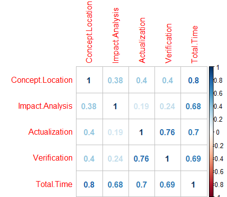

\* _Correlations of each time distribution pair_


We find that all the correlations are positive, total time ~ concept location has the largest correlation which is 0.8. The coefficient indicates that the relationship of total time and concept location is nearly linear, we believe that it is caused because concept location usually take the heaviest weight of the total changing time. Also, verfication ~ actualization has a coefficient of 0.76, which is also indicating they're having a pretty strong linear relationship.

### RQ2. Average time spent on each class/method

In research question 1, we gathered the information of the timing and number of method/class changed per change. Before we use them to do research question 2, we would like to clear the data by following steps: 

1.	For class/method ~ time relation research, we would like to remove sample instances that do not record the number of changed classes. Same process for method ~ time relationship research.
2.	Then we calculate the average time for changing a class or method for each change, i.e. time/class or time/method metrics.
3.	Then we used the box-plot to remove the outliers. 
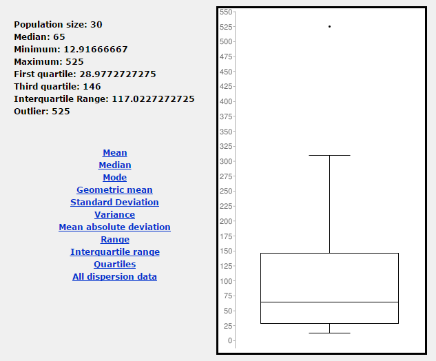

After the clear, we 29 records for class ~ time (5 no record, 1 outlier); 19 records for method ~ time (15 no record, 1 outlier)

#### Class ~ time relationship:
We used RStudio’s lm (linear model) to do the regression and obtained the following graph and regression model:
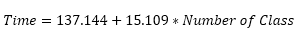
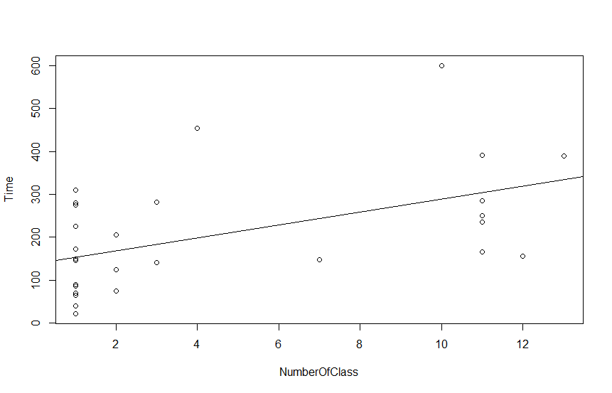

#### Method ~ time relationship:
We used RStudio’s lm (linear model) to do the regression and obtained the following graph and regression model:
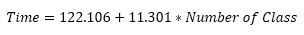
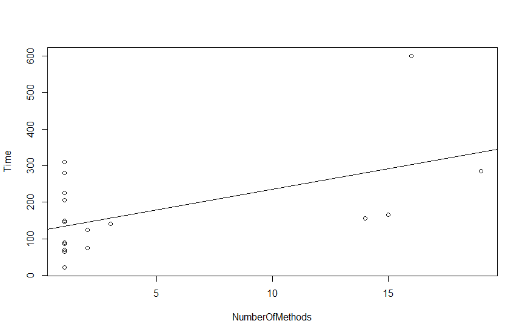

#### Raw data points distribution
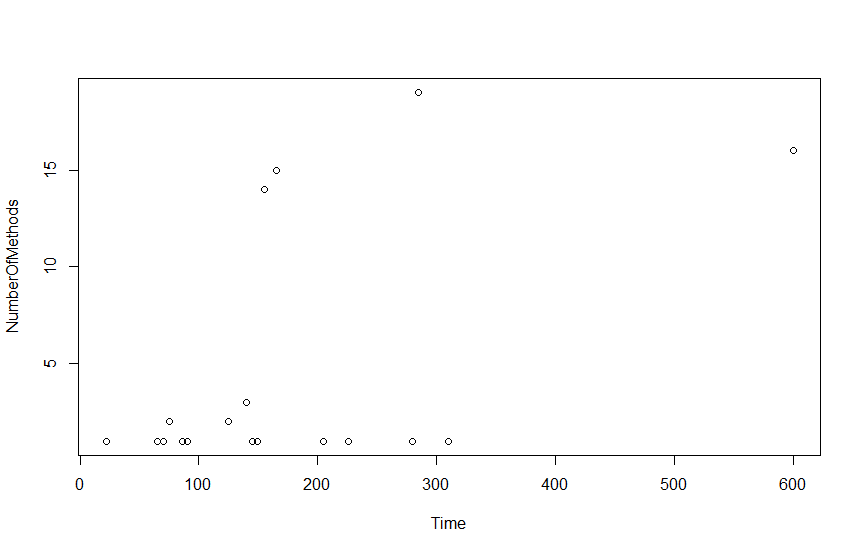
\* _Time ~ number of methods data points distribution_

#### Conclusion:
From the clean data, we can draw the conclusion that it takes around 15 minutes to change a class and it take around 11.3 minutes to change a method. And when we apply this modle to the raw data, we find out that the model fits logs that has more than 10 methods/class better than those has less than 10. But the overall performance is not very stable. The threat here is the limited number of request logs we have. 

Also, before the research, we planned to determine if the marginal time for changing a method/class is increasing or decrease by checking if the scatter plot is concave up or down. However, due to the lack of instances, or it’s naturally to be this, we’re not able to find any clue about this question from this plot. 

### RQ3. Coverage and log conclusion quality

Our research question 3 is to find out the relationship between conclusion quality and its coverage to the whole request report.

1. First, we let a group of two graduate students read and rate the `quality` of each of the 35 request log conclusions from 1(bad) to 5(good). Then we define the `coverage` of a log conclusion be the ratio of 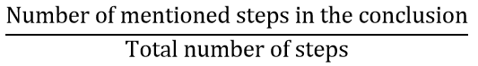

2. Then, we use box plot to eliminate those outliers.
3. Next, we determine the correlation of coverage and quality (the rate). 
4. Last but not least, we determine the regression model of coverage and quality to determine how much of the coverage is needed to meet the standard of a fair (rate = 3) request report.

Since different evaluator might have different standard when he or she's rating the log. So after the two graduate students finish their reading, we plot those rates and start the process to remove outlier. 

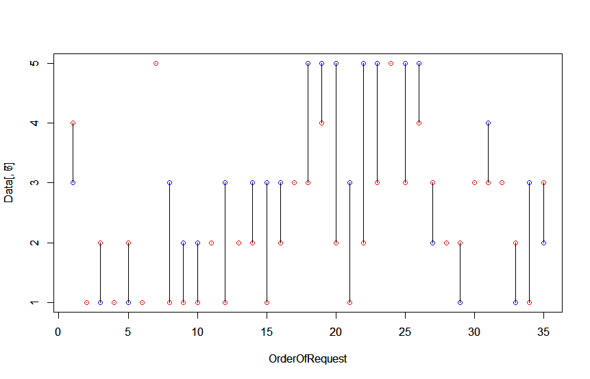

\* _Distribution of ratings from student blue and student red_

We have many different ways to determine the outliers:

1. For each request report, if |rate of student 1 – rate of student 2| <=1, then we think the rate is justified, otherwise we would prefer to remove it from further discussion.
2.	For each request report, if |(rate of student 1 +1) – rate of student 2| <=1, then we think the rate is justified, otherwise we would prefer to remove it from further discussion.
3.	For each request report, if |rate of student 1 – (rate of student 2 + 1)| <=1, then we think the rate is justified, otherwise we would prefer to remove it from further discussion.

Note: Theoretically, there should be more ways like |rate of student 1 – (rate of student 2 + 2)|, etc. But from the raw difference plot we noticed that most of the difference ranged from 1 to 2, so the addition of plus/minus 1 is enough.

In order to have as many instances as possible, we would like to pick the way that returns largest sample pool. 1 returns 10 outliers, 2 returns 17, 3 returns 9. Thus way 3 is picked, and all the rates are curved to (rate of student 1 + (rate of student 2 +1))/2.

After removing the outliers, we do the `coverage ~ rate` correlation and regression analysis.
The correlation analysis returns that the correlation coefficient between coverage and rate is 0.6389. Thus they're positively related and more coverage indicates that the quality of conclusion is better.

The regression model show that the `coverage ~ rate` follows the formula of Rate=2.062+7.979*Coverage.

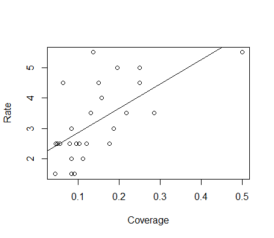

#### Conclusion:
The data are not very friendly to us thus the model gives at least 2.062 for each request since coverage is always positive. What we can conclude from the regression is that the coefficient for coverage is positive thus it is also an evidence to support what we have got in correlation analysis. In summary, the higher coverage, the better log conclusion.


