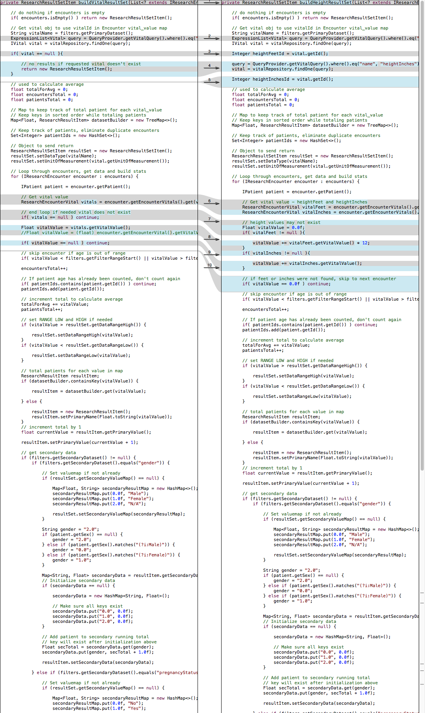

## Group 1

`zxq150130` Shane Qi  
`txz150730` Tianxiang Zhang

## Automated Refactoring

### 1. Internal Duplication in `ResearchService.java`

This class is flagged with internal duplicate smell because these 3 methods have duplication code with each other:

`buildVitalResultSet(List encounters, ResearchFilterItem filters): ResearchResultSetItem`  
`buildHeightResultSet(List encounters, ResearchFilterItem filters): ResearchResultSetItem`  
`buildAgeResultSet(List encounters, ResearchFilterItem filters): ResearchResultSetItem`  

#### Rationale:
Use automated refactoring tool from IntelliJ IDE (Failed to do it automatically). 
Instead of automation, we do the refactoring manually, and the new rationale is to extract methods.

#### Steps:
1. We used a diff inspecting tool 'FileMerge' to find out the duplicated code.  

2. We selected those duplicated code and tried 'extract method' operation of the IDE, but it failed. The error message was: 'Cannot perform refactoring. Selected block should present a set of statements or an expression'. So that we decided to do the refactoring manually.

3. We created a private method `private void getSecondaryData()`, copied the duplicated code and pasted code into the new-created method.

4. There were many 'unresolved symbol' errors because many variables were local variables.

5. We manually extracted those unresolved symbol variables to the method's parameter.

6. Finally the method turned out to be `private void getSecondaryData(ResearchResultSetItem resultSet, ResearchFilterItem filters, ResearchResultItem resultItem, IResearchEncounter encounter)`.

7. We replaced duplicated code with the new extracted method.

8. We ran test cases, and all test cases passed.

9. We run Incode again, one of the three bad smell went away. We inspected the rest two methods, their duplicated code is variable declaring which is unavoidable.

10. We asserted that the refactoring succeed.

### 2. Message Chain in `ItemModelMapper.java `

This class is marked as having message chains inside the `createMissionTripItem(IMissionTrip missionTrip)` method.

#### Rationale:
Use automated refactoring tools from IntelliJ IDE to refactor the code.

#### Steps:
1. We checked the code, and figured out that the chain looks like this:
   missionTripItem.setTripCountry(missionTrip.getMissionCity().getMissionCountry().getName());
   
2. Starting from the object, select part of the chain `missionTrip.getMissionCity()`.

3. Then we clicked Refactor on tool bar, navigated to Extract -> Method and then it creates a new method called getMissionCityObject.

4. The tool filled in the type of parameter object.

5. The tool prompted us there are three more use of missionTrip.getMissionCity() and if we want to replace all of them.

6. We reviewed each of them and replaced all of the.

7. Rerun the InCode analysis, ta-da, the smell’s gone.

## Manual Refactoring

### 1. Feature Envy in `LocaleUnitConverter.java`

#### Rationale:

#### Steps:
1. We inspected the method `public static PatientItem toMetric(PatientItem patient)`. The problem was that the method accessed the data of a `PatientItem` object a lot.

2. We decided move the operations of the method into `PatientItem.java`.

3. We cut the whole method and pasted it into `PatientItem.java`.

4. We removed `static` symbol, changed the method return type to `void`, removed `return` statement and delete the parameter. Because all the operations in the method would be performed on the object itself.

5. There appeared many 'unresolved symbol' errors because we removed parameter, and there were many external invocations on the parameter variable. We changed all the external invocations to internal invocations, eg: changing `patient.getHeightFeet()` to `getHeightFeet()`.

6. We delete the `null` handling code since the object can't be `null` anymore.

7. We found out usages of the methods and replaced them all with the new extracted method.

8. We ran test cases, and all test cases passed.

9. We run Incode again, the bad smell went away so that we asserted that the refactoring succeed.

### 2. Message Chain in `MissionTripService.java`

This class is marked as having message chains inside the `createNewTrip(TripItem tripitem) ` method. The long chain made the code extremely confusing and redundant.

#### Rationale:
The method used to have too many message chains as parameters to set up its data fields. Thus what we want to do is to delegate all of those chains as the return value of some methods.

#### Steps:

1. We check the code, and figure out that the chain looks like this:
  response.setResponseObject(itemModelMapper.createTripItem(missionTrip.getMissionTeam().getName(),
  missionTrip.getMissionCity().getName(), missionTrip.getMissionCity().getMissionCountry().getName(),
  missionTrip.getStartDate(), missionTrip.getEndDate()));    ----- in one single line

2. We notice that the missionTrip calls missionTeam and missionCity objects for many times. And we believe those calling methods are not necessary to appear more than once.

3. To delegate the objects (e.g. missionCity object delegated for `missionTrip.getMissionCity()`), we created two new methods `returnMissionTeam(IMissionTrip MT)` and `returnMissionCity(IMissionTrip MT)`.

4. For `returnMissionTeam(IMissionTrip MT)`, the methods does not do any comlicated thing but simply return MT.getMissionTeam object.

5. For `returnMissionCity(IMissionTrip MT)`, the methods does not do any comlicated thing but simply return MT.getMissionCity object.

6. Then we replace missionTrip.getMissionTeam() by returnMissionTeam(missionTrip).

7. We also replace missionTrip.getMissionCity() by returnMissionCity(missionTrip).

8. Thus the chain length is reduced and the repeated occurrence of missionTrip.getMissionCity() is removed.

9. Then we run the analysis, the message chain smell is removed.

## Analysis

### Advantage of manual refactoring:

1. One of the biggest difference between automated refactoring and manual refactoring is that manual refactoring provides the developers a better feeling of safety. No one wants to bet his or her salary on a feature of IDE which might have bugs with it. Hand-trace the code and then refactor it would be a safer way to control the entire process of refactoring.

2. Developers can have a look on the code and recap the solution and structure of the project thus might have a better understanding to the project.

### Disadvantage of manual refactoring:

1. However, the second advantage of manual refactoring is actually also sort of a disadvantage for manual refactoring since it might take very long time for developer to review the code.

### Difficulties of manual refactoring:

1. Reviewing the code might be time-consuming.
2. Refactoring other related methods might also be time-consuming. E.g. E.g. when refactor method A(p1,p2,p3) to A(p1,p2), we have to manually find out all other occurrence of method A under the same class or even the whole project.

### Advantage of automated refactoring:

1. By doing automated refactoring, the IDE intelligently do the refactoring for us and make the changes all of the whole class thus we developers do not need to spend time looking around the whole project to figure out what else are left. E.g. when refactor method A(p1,p2,p3) to A(p1,p2), the IDE refactors all other occurrence of A as well.

2. By doing so, we can run the refactoring very fast (simply clicks), and the corresponding ‘undo’ action is also very easy. However, for manual refactoring, we need to pay more attention on how to refactor and how to undo the wrong approach just like the routine coding activities.

### Disadvantage of automated refactoring:

1. Imprecise, no one knows when the automated refactoring will err. 

### Difficulties of automated refactoring:

1. The accuracy is not guaranteed. So each automated refactoring might need a lot of proofread and test cases.

## Testing
### Internal Duplication in `ResearchService.java`

### Message Chain in `ItemModelMapper.java`

### Feature Envy in `LocaleUnitConverter.java`

### Message Chain in `MissionTripService.java`
After the refactoring, the only change of the class is the parameter of Response object. It used to have chains as the parameter of TeamName, CoutryName, and CityName and by now it got them by calling new methods which return them.
We set up a set of test cases to focus on testing the Response object since after the method extracting, the Response object is the only object that has data field changed. In our test cases, we set up the TripItem with Team = Group 1, City = Richardson, Country = USA, start and end dates are 10/1/2016 and 12/31/2016. Then we test the Response object if all the data fields are obtained/called appropriately. As expected, all five test cases passed.
